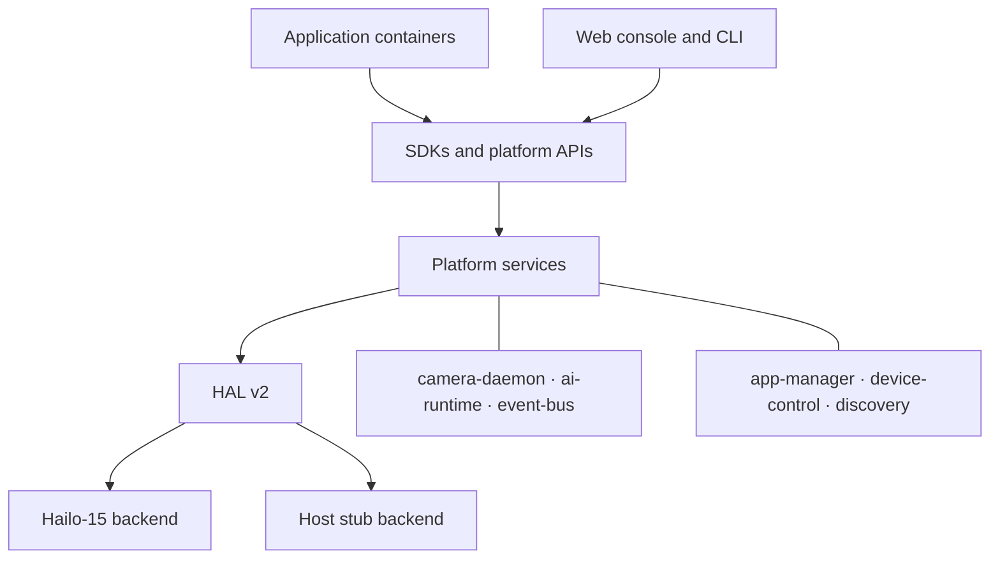

# NeoRuntime

Open-source edge AI runtime for smart cameras and edge devices.

[](https://github.com/camthink-ai/neoruntime/actions/workflows/ci.yml)
[](https://github.com/camthink-ai/neoruntime/actions/workflows/release.yml)
[](https://github.com/camthink-ai/neoruntime/releases/latest)
[](LICENSE)

[Quick start](#quick-start) ·
[Architecture](#architecture) ·
[Documentation](docs/README.md) ·
[Download](https://github.com/camthink-ai/neoruntime/releases/latest) ·
[SDKs](https://github.com/camthink-ai/neoruntime-sdks) ·
[Sample apps](https://github.com/camthink-ai/neoruntime-apps)

NeoRuntime is the device-side platform for CamThink's smart IP cameras,
industrial cameras, and edge boxes. It brings video pipelines, AI inference,
application lifecycle management, device control, streaming, and a web console
together behind a common API and hardware abstraction layer.

The repository currently provides a Hailo-15 backend for device releases and a
stub backend for host development and testing. Additional SoCs can be supported
by implementing the HAL v2 interfaces.

## Highlights

- **Video and streaming:** camera pipelines, H.264/H.265 encoding, RTSP, shared
  memory, and DMA-BUF data paths.
- **AI runtime:** model lifecycle, inference sessions, scheduling, and result
  distribution.
- **Application platform:** container lifecycle, resource controls, permissions,
  and application manifests.
- **Device integration:** MCU peripherals, lens and lighting control, discovery,
  ONVIF, and OS updates.
- **Developer interfaces:** REST, gRPC, Unix sockets, CLI tools, and Python/C++
  SDKs.
- **Operations:** browser-based management console, systemd services, release
  packaging, deployment, and rollback tooling.

## Start Here

| I want to... | Start with |
| ------------ | ---------- |
| Validate or develop NeoRuntime on a host | [Host build](#host-build) |
| Build a Hailo-15 device release | [Docker release build](#hailo-15-release-build) |
| Download a packaged release | [Latest GitHub release](https://github.com/camthink-ai/neoruntime/releases/latest) |
| Deploy or upgrade a device | [Deployment guide](docs/deployment/DEPLOYMENT.md) |
| Build an application | [NeoRuntime Apps](https://github.com/camthink-ai/neoruntime-apps) |
| Integrate through Python or C++ | [NeoRuntime SDKs](https://github.com/camthink-ai/neoruntime-sdks) |
| Port NeoRuntime to another SoC | [HAL v2 overview](docs/architecture/hal_v2_overview.md) |

## Quick Start

### Host build

The Go services and web console can be built without camera or accelerator
hardware:

```bash
git clone https://github.com/camthink-ai/neoruntime.git
cd neoruntime

./scripts/setup_env.sh layer1
make build-ci
make test
```

Build the native services and stub HAL as well:

```bash
./scripts/setup_env.sh layer2
make build-native HAL_PLATFORM=stub
```

Service binaries are written to `build/output/`, and web assets to `web/dist/`.
See the [quick-start guide](docs/getting-started/QUICK_START.md) for deployment
and service startup instructions.

### Hailo-15 release build

The release container includes the Hailo/Poky SDK. With Git and Docker
installed, build a device package with:

```bash
git clone https://github.com/camthink-ai/neoruntime.git
cd neoruntime

make docker-pack-release VERSION=1.0.0
```

The package is written to
`build/release/neoruntime-hailo15-1.0.0.tar.gz`. MCU OTA firmware is rebuilt by
default; pass `BUILD_MCU_FW=0` only when packaging existing MCU artifacts.

For local cross-compilation with a vendor SDK, see the
[build guide](docs/getting-started/BUILD.md).

## Platform Support

| Platform | Backend | Intended use | Status |
| -------- | ------- | ------------ | ------ |
| Hailo-15 | `hal_v2/platforms/hailo15/` | Device releases | Ready |
| Host stub | `hal_v2/platforms/stub/` | Local development | Ready |
| Other SoCs | Custom HAL required | Product ports | Not bundled |

The stub backend validates host-side integration but does not emulate the full
camera, ISP, or NPU behavior of a target device.

## Architecture



Applications use SDKs over gRPC, Unix sockets, and shared memory. Platform
services own media, inference, application, event, and device lifecycles, while
HAL v2 isolates those services from vendor-specific hardware runtimes. See the
[architecture overview](docs/architecture/README.md) for component and data-flow
diagrams.

## Ecosystem

| Repository | Purpose |
| ---------- | ------- |
| [`camthink-ai/neoruntime`](https://github.com/camthink-ai/neoruntime) | Device runtime, services, HAL, web console, and deployment assets |
| [`camthink-ai/neoruntime-sdks`](https://github.com/camthink-ai/neoruntime-sdks) | Python/C++ client SDKs and shared protocol definitions |
| [`camthink-ai/neoruntime-apps`](https://github.com/camthink-ai/neoruntime-apps) | Application templates, examples, tools, and showcases |

## Repository Layout

| Path | Contents |
| ---- | -------- |
| `platform/` | Go and C++ platform services |
| `hal_v2/` | HAL v2 interfaces and backends |
| `mcu_board_prj/` | STM32G0 MCU firmware and OTA packaging |
| `web/` | React web console |
| `configs/` | Service configuration templates |
| `deploy/` | Runtime deployment assets |
| `systemd/` | System service units |
| `scripts/` | Build, deployment, and maintenance scripts |
| `tools/` | CLI and diagnostic tools |
| `docs/` | Project documentation |
| `tests/` | Unit and integration test assets |

## Build Requirements

| Workflow | Requirements |
| -------- | ------------ |
| Go services and web console | Go 1.25+, protobuf tools, Node.js 24, pnpm 10 |
| Native host build | Above, plus CMake 3.16+, GCC/G++ 10+, and gRPC C++ tools |
| Hailo-15 build in Docker | Git and Docker |
| Local Hailo-15 cross-build | Native toolchain plus the Hailo/Poky SDK |

Run `make help` for the maintained list of build, packaging, and test targets.
Local settings can be stored in the gitignored `Makefile.local`:

```makefile
SDK_PATH=/opt/poky/4.0.23
HAL_PLATFORM=hailo15
```

## Configuration

Runtime secrets are not committed. Configure platform API authentication at
deployment time:

```bash
export AIPC_TOKEN_KEY="<random-signing-secret>"
export AIPC_AUTH_USERNAME="admin"
export AIPC_AUTH_PASSWORD="<strong-password>"
```

See the [configuration reference](docs/references/config-reference.md) for
service settings and deployment-time overrides.

## Documentation

| Document | Purpose |
| -------- | ------- |
| [Documentation index](docs/README.md) | All guides and references |
| [Quick-start guide](docs/getting-started/QUICK_START.md) | First build, deployment, and service startup |
| [Build guide](docs/getting-started/BUILD.md) | Build layers, targets, and prerequisites |
| [Architecture overview](docs/architecture/README.md) | Components, data flows, and extension points |
| [API specification](docs/api/swagger.yaml) | Platform OpenAPI definition |
| [CLI guide](docs/references/cli-guide.md) | `aipc-cli` command reference |
| [Deployment guide](docs/deployment/DEPLOYMENT.md) | Device packaging, deployment, and rollback |
| [Testing guide](tests/TESTING_GUIDE.md) | Unit, integration, and device testing |
| [Contributing guide](CONTRIBUTING.md) | Branch, commit, and pull request conventions |

## Contributing

Contributions are welcome. Start from the latest `develop` branch, keep changes
focused, and run the checks that cover your change. See
[CONTRIBUTING.md](CONTRIBUTING.md) for the complete workflow.

## License

NeoRuntime is licensed under the [MIT License](LICENSE).
