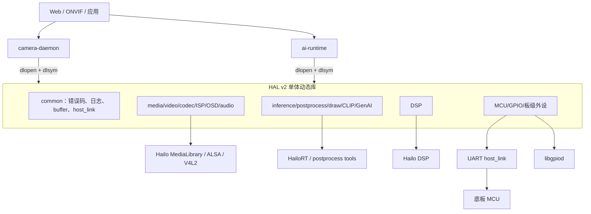
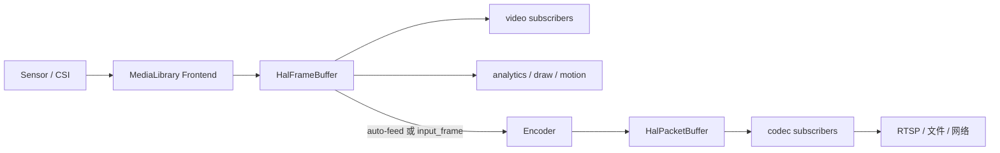
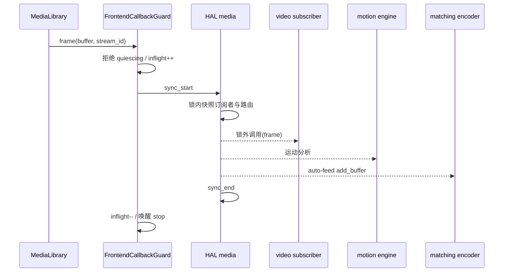
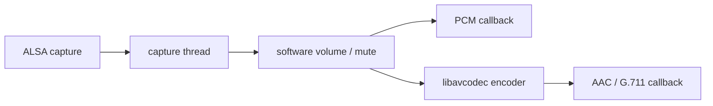
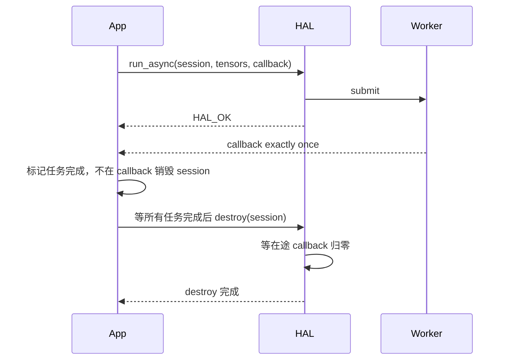
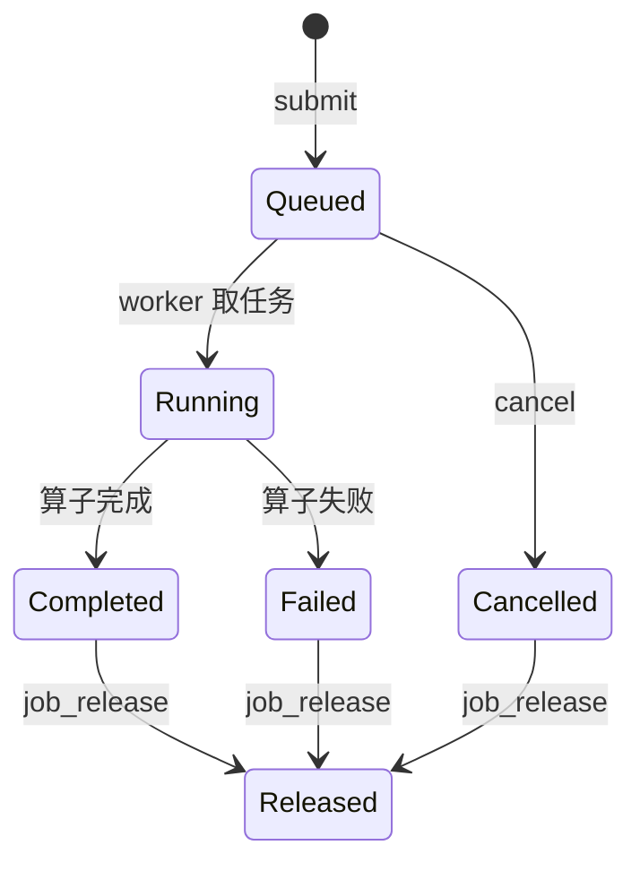
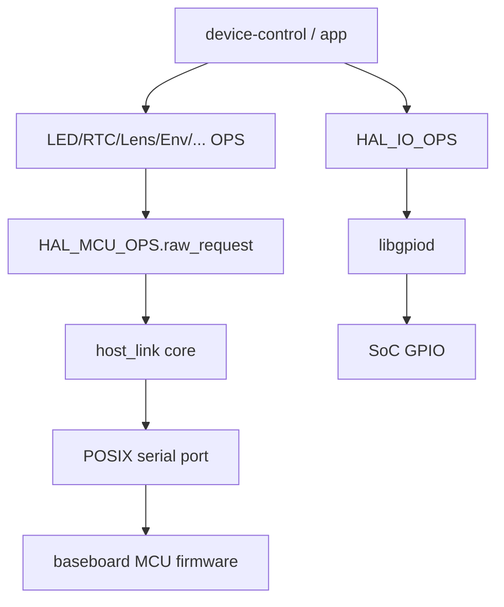

# HAL v2 代码深度解读

> 适用仓库：NeoRuntime / `ne503-aipc`<br>
> 解读基线：`develop` 分支，提交 `5dd77500c25e`，2026-09-23<br>
> 主要代码范围：`hal_v2/`、`platform/camera-daemon/`、`platform/ai-runtime/`<br>
> 阅读定位：本文解释的是 NeoRuntime 的业务 HAL v2，不是 `mcu_board_prj/` 下 STM32 官方 HAL Driver。

本文不是把头文件逐行翻译一遍，而是从“上层怎样加载 HAL、对象由谁创建、数据怎样流动、线程怎样退出、配置变化怎样传播、失败后怎样恢复”这些实际问题出发，把公开接口和 Hailo-15、stub 两套实现串起来。API 的精确字段仍以 `hal_v2/include/` 为准；本文重点补充单看声明看不出的实现约束。

---

## 目录

1. [先建立整体心智模型](#1-先建立整体心智模型)
2. [代码目录与阅读顺序](#2-代码目录与阅读顺序)
3. [二进制接口：OPS 表与动态加载](#3-二进制接口ops-表与动态加载)
4. [通用返回值、状态和内存模型](#4-通用返回值状态和内存模型)
5. [媒体总控 HAL_MEDIA_OPS](#5-媒体总控-hal_media_ops)
6. [视频 HAL_VIDEO_OPS](#6-视频-hal_video_ops)
7. [编码 HAL_CODEC_OPS](#7-编码-hal_codec_ops)
8. [ISP HAL_ISP_OPS](#8-isp-hal_isp_ops)
9. [OSD 与音频](#9-osd-与音频)
10. [推理 HAL_INFERENCE_OPS](#10-推理-hal_inference_ops)
11. [后处理、绘制、CLIP 与 GenAI](#11-后处理绘制clip-与-genai)
12. [DSP HAL_DSP_OPS](#12-dsp-hal_dsp_ops)
13. [MCU、GPIO 与板级外设](#13-mcugpio-与板级外设)
14. [stub 后端到底能测什么](#14-stub-后端到底能测什么)
15. [构建、链接与部署](#15-构建链接与部署)
16. [完整生命周期示例](#16-完整生命周期示例)
17. [并发、所有权和回调规则](#17-并发所有权和回调规则)
18. [新增平台或模块的实现方法](#18-新增平台或模块的实现方法)
19. [调试与故障定位](#19-调试与故障定位)
20. [测试入口与覆盖边界](#20-测试入口与覆盖边界)
21. [当前代码中的风险与技术债](#21-当前代码中的风险与技术债)
22. [源码导航表](#22-源码导航表)

---

## 1. 先建立整体心智模型

### 1.1 HAL 在系统中的位置

HAL v2 不是一个常驻服务，而是一组 C ABI 的函数表。默认情况下，它们被链接进同一个动态库 `libaipc_hal.so`。`camera-daemon`、`ai-runtime` 等上层进程在运行时用 `dlopen` 打开库，再用 `dlsym` 找到所需的全局 OPS 符号。



这个架构有四个直接后果：

1. **上层不应依赖 C++ 实现类型。** 对外边界是 `extern "C"` 可见的 C 结构体与函数指针。
2. **能力发现分为“有无符号”和“函数是否为空”两级。** `dlsym` 成功不代表该后端真的支持每项功能。
3. **一个单体库只能有一套同名 OPS。** 例如 Hailo-15 和 stub 都定义 `HAL_VIDEO_OPS`，它们靠构建时选平台，而不是在同一库内运行时切换。
4. **上下文是不透明句柄。** `void *ctx` 的真实类型只在对应后端内部可见；调用者只能按创建它的 OPS 表销毁和操作。

### 1.2 两条主数据通路

媒体数据通路：



AI 数据通路：


`camera-daemon` 主要消费第一条链，`ai-runtime` 主要消费第二条链。媒体前端回调里，当前实现会先调用用户的视频订阅者，再执行自动送编码器；这使得分析结果或原地绘制有机会在编码前附着到同一帧上。

### 1.3 三层对象关系

最容易混淆的是媒体对象层级：

- `media_ctx`：整条 MediaLibrary pipeline 的所有者，管理 profile、前端、编码器和子上下文。
- `video_ctx`：一条原始视频流的视图，可以独立创建，也可以由 `media_ctx` 生成。
- `codec_ctx`：一条编码流的视图，可以独立创建，也可以由 `media_ctx` 生成。

当 `HalVideoConfig.type == HAL_VIDEO_TYPE_FROM_MEDIA` 或 `HalCodecConfig.type == HAL_CODEC_TYPE_FROM_MEDIA` 时，子上下文属于 `media_ctx`。调用者不能对它执行独立 `init/deinit`，而且 pipeline 重建后旧指针可能失效。

---

## 2. 代码目录与阅读顺序

### 2.1 目录职责

| 目录 | 职责 | 阅读提示 |
| --- | --- | --- |
| `hal_v2/include/common/` | 错误码、状态、buffer、日志、工厂数据格式 | 先读，决定所有模块的基本契约 |
| `hal_v2/include/media/` | media/video/codec/ISP/OSD/audio 公共 ABI | 公开接口的权威来源 |
| `hal_v2/include/model/` | inference/postprocess/draw/CLIP/GenAI | 特别关注 tensor 所有权和 ABI size |
| `hal_v2/include/dsp/` | 同步与异步图像算子 | 注意异步参数的深浅拷贝边界 |
| `hal_v2/include/peripheral/` | MCU、GPIO、板级设备 | 多数设备 OPS 是 MCU 命令的薄封装 |
| `hal_v2/common/` | 平台无关实现 | 日志、buffer、CPU draw、CLIP、host_link 在这里 |
| `hal_v2/platforms/hailo15/` | Hailo-15 真正硬件实现 | 媒体实现体量最大，也是并发规则来源 |
| `hal_v2/platforms/stub/` | 宿主机占位实现 | 用来验证装载/配置/错误路径，不是仿真器 |
| `hal_v2/examples/` | 端到端调用样例 | 找生命周期和硬件验证入口最快 |
| `hal_v2/tests/` | 原生单元测试 | 当前主要覆盖异步 provider 生命周期 |
| `platform/camera-daemon/` | 媒体 HAL 消费者 | 看动态加载、可选符号和业务编排 |
| `platform/ai-runtime/` | AI HAL 消费者 | 看推理 ABI size 防护和尾部能力探测 |

### 2.2 推荐阅读路线

如果目标是快速理解而不是维护某一个函数，建议按下面顺序：

1. `hal_common.h`、`hal_buffer.h`：先理解返回值和帧。
2. `hal_media.h`、`hal_video.h`、`hal_codec.h`：建立 pipeline/stream 的关系。
3. `platform/camera-daemon/src/hal_loader.cpp`：理解库怎样被消费。
4. `hailo15_media_impl.cpp`：重点搜 `init`、`start`、frontend callback、`stop`、dynamic change。
5. `hal_inference.h` 和 `hal_ml_loader.cpp`：理解可演进 ABI。
6. `hailo15_inference_impl.cpp`：看共享 VDevice、DMA 输入、同步/异步推理。
7. 最后按业务需要进入 ISP、DSP 或 MCU 外设。

不要一开始就顺序阅读六千多行的 `hailo15_media_impl.cpp`。先带着“初始化、启停、回调、重配、销毁”五个问题定位，效率会高得多。

---

## 3. 二进制接口：OPS 表与动态加载

### 3.1 OPS 表模式

每个模块公开一个结构体类型和一个全局实例：

```c
typedef struct {
    int (*init)(const HalXxxConfig *config, void **ctx);
    int (*start)(void *ctx);
    int (*stop)(void *ctx);
    int (*deinit)(void *ctx);
} HalXxxOps;

extern HalXxxOps HAL_XXX_OPS;
```

实际结构远比这个例子丰富，但设计一致。调用者不直接调用 `hailo15_xxx_*`，只通过函数表；平台实现负责把同名全局变量初始化为对应函数地址。

这种设计比导出几十个零散 C 函数更方便：

- 一个 `dlsym` 得到整个模块；
- 可选功能可以用 `NULL` 表示；
- stub 和硬件后端共享头文件；
- 上层容易保存一组能力指针。

但它也有 ABI 风险：旧库里的结构体可能比新头文件短。仅检查尾部函数指针是否为 `NULL`，仍可能先越界读取。当前只有推理表提供独立大小符号解决这个问题。

### 3.2 camera-daemon 的装载策略

`platform/camera-daemon/src/hal_loader.cpp` 体现了真实依赖关系：

- `HAL_VIDEO_OPS` 是基本必需能力；
- codec、OSD、draw、media、ISP、audio、LED、sensor、MCU、环境控制、alarm、RS485 等按运行功能选择；
- inference、postprocess、DSP、frame-buffer 也以可选符号加载；
- 某个非核心符号缺失时，应降级相应功能，而不是假设整个库损坏。

实际部署路径通常由配置给出，例如 `/data/aipc/lib/hal/libaipc_hal.so`。库文件本身带 `SONAME libaipc_hal.so.2`，部署时一般同时存在版本文件和软链接。

### 3.3 ai-runtime 的 ABI size 防护

`platform/ai-runtime/src/hal_ml_loader.cpp` 除了加载 `HAL_INFERENCE_OPS`，还尝试加载：

```c
extern const uint32_t HAL_INFERENCE_OPS_ABI_SIZE;
```

调用尾部新接口前应使用头文件中的辅助宏或等价判断：

```c
if (hal_inference_ops_has(ops_size, bind_dma_frame) &&
    ops->bind_dma_frame != NULL) {
    /* 可以安全调用 */
}
```

若旧库没有 `HAL_INFERENCE_OPS_ABI_SIZE`，loader 会把新尾部方法视为不可用，而不是直接访问。这个模式值得推广到其他 OPS。

### 3.4 符号存在不等于能力可用

能力判断至少要做三步：

1. `dlsym("HAL_XXX_OPS")` 是否成功；
2. 目标函数指针是否非空；
3. 调用是否返回 `HAL_ERR_NOT_SUPPORTED` / `HAL_ERR_NOT_IMPLEMENTED`。

例如 stub 库会导出 `HAL_DSP_OPS`，但算子基本返回“不支持”；Hailo-15 在缺少可选 SDK 组件时，也可能保留模块而让相关调用明确失败。不要把 `dlsym` 当成完整 feature probe。

### 3.5 当前导出的主要全局符号

| 领域 | OPS 符号 | 主要头文件 |
| --- | --- | --- |
| 媒体总控 | `HAL_MEDIA_OPS` | `media/hal_media.h` |
| 帧分配 | `HAL_FRAME_BUFFER_OPS` | `common/hal_buffer.h` |
| 视频 | `HAL_VIDEO_OPS` | `media/hal_video.h` |
| 编码 | `HAL_CODEC_OPS` | `media/hal_codec.h` |
| ISP | `HAL_ISP_OPS` | `media/hal_isp.h` |
| OSD | `HAL_OSD_OPS` | `media/hal_osd.h` |
| 音频 | `HAL_AUDIO_OPS` | `media/hal_audio.h` |
| 推理 | `HAL_INFERENCE_OPS` | `model/hal_inference.h` |
| 后处理 | `HAL_POSTPROCESS_OPS` | `model/hal_postprocess.h` |
| 绘制 | `HAL_DRAW_OPS` | `model/hal_draw.h` |
| CLIP 文本 | `HAL_CLIP_TEXT_ENCODER_OPS` | `model/hal_clip_text_encoder_ops.h` |
| GenAI | `HAL_GENAI_OPS` | `model/hal_genai.h` |
| DSP | `HAL_DSP_OPS` | `dsp/hal_dsp.h` |
| MCU / IO | `HAL_MCU_OPS`、`HAL_IO_OPS` | `peripheral/hal_mcu.h`、`hal_io.h` |
| 板级设备 | `HAL_LED_OPS` 等 | `peripheral/devices/*.h` |

`HAL_FRAME_BUFFER_OPS` 当前由 Hailo 媒体实现导出，已有宿主 stub 构建中没有这个符号；因此它必须按可选能力处理。

---

## 4. 通用返回值、状态和内存模型

### 4.1 返回值不是简单的“非零即失败”

`hal_common.h` 定义了三个类别：

- `HAL_OK == 0`：成功；
- `HAL_REINIT_PERFORMED == 1`：成功，但内部执行了完整重建；
- 所有错误是负数，例如参数错误、不支持、超时、忙、资源不足等。

正确的通用判断是：

```c
int rc = HAL_MEDIA_OPS.dynamic_change_image_config(media_ctx, &cfg);
if (rc < 0) {
    /* 失败 */
} else if (rc == HAL_REINIT_PERFORMED) {
    /* 成功，但重新获取子上下文并重新订阅 */
} else {
    /* 普通成功 */
}
```

写成 `if (rc != HAL_OK) fail;` 会把一次成功的 fallback 重建误报成失败。

### 4.2 通用状态机

模块普遍使用 `UNINITIALIZED -> INITIALIZED -> STARTED -> STOPPED/ERROR` 这类状态。具体枚举以头文件为准，但维护代码时应遵守下面的不变量：

- `init` 只负责创建资源，不应假定数据流已经启动；
- `start` 允许真正建立回调和硬件流；
- `stop` 先阻止新回调，再等待在途回调退出；
- `deinit` 只能在没有外部使用者之后释放上下文；
- 重复调用是否幂等由模块决定，不能统一假设。

### 4.3 HalFrameBuffer

`HalFrameBuffer` 是原始图像的跨模块载体，包含：

- 宽、高、像素格式；
- 内存类型：DMA-BUF、MMAP、普通 malloc；
- 多 plane 地址、DMA fd、stride、size；
- 时间戳、序号等元数据；
- 后端私有指针 `priv`。

这里要区分“描述符”和“像素内存”：

- 回调参数中的 `HalFrameBuffer *` 描述符通常只在回调栈内有效；
- `priv` 常持有对 MediaLibrary buffer 的 `shared_ptr` 包装；
- `release` 释放的是该后端引用，不等于可以在释放后继续使用 plane 指针或 fd；
- 没有通用的 `ref()` OPS，所以不要自行异步保存回调里的裸指针。

Hailo 实现的回调典型流程是：在栈上构造 `HalFrameBuffer`，为 `priv` 分配持有底层 `shared_ptr` 的包装对象，调用用户回调；用户在回调中完成处理并调用对应 `release`。如果业务要跨线程保留帧，应先复制到自己拥有的 buffer，或者引入明确的引用传递机制。

### 4.4 HalPacketBuffer

`HalPacketBuffer` 承载编码数据，支持 H.264、H.265、MJPEG、AAC、G.711、PCM 和通用 DATA。除 payload 外还包含时间戳、帧类型/关键帧信息和私有句柄。

Hailo 编码回调也使用“栈上描述符 + 私有共享所有权包装”的方式。订阅者必须按 codec OPS 的约定释放。pipeline 重建后，编码器可能返回容量大于有效 Annex-B 数据的 buffer，当前适配层会裁掉尾部零填充，`size` 表示真正 payload 长度。

### 4.5 配置结构的初始化

跨 ABI 传递的配置结构应始终：

1. 整体清零；
2. 再设置显式字段；
3. 优先调用模块提供的默认值/初始化辅助函数；
4. 不要把未初始化的尾部字段传给新库。

```c
HalVideoConfig cfg = {0};
cfg.type = HAL_VIDEO_TYPE_CSI;
/* 再填具体字段 */
```

这是当前结构体没有统一 `struct_size` 字段时，降低版本混用风险的基本做法。

### 4.6 日志

`common/hal_log.c` 支持：

- 日志级别；
- 颜色和时间戳；
- 控制台输出；
- 文件输出与轮转；
- 用户提供的输出回调。

HAL 后端统一使用这套日志，定位问题时应先确认运行进程是否把所需级别打开。用户输出回调必须足够快，并避免反向调用可能再次打日志且持有同一业务锁的路径。

---

## 5. 媒体总控 HAL_MEDIA_OPS

### 5.1 它为什么是“总控”

`HAL_MEDIA_OPS` 不只是几个媒体工具函数，而是 Hailo MediaLibrary pipeline 的聚合根：

- 读取和校验整份媒体 JSON；
- 创建前端和 encoder；
- 按 profile 生成 video/codec 子上下文；
- 管理连接关系与自动送帧；
- 处理图像动态配置、profile 切换、流增删和 pipeline 重配；
- 聚合热管理、运动检测、隐私遮罩、analytics 附着等控制面。

因此，只要视频与编码来自同一媒体 pipeline，应该先创建 `media_ctx`，再通过它取得子流，而不是独立初始化多个互不知情的 video/codec。

### 5.2 初始化配置来源与优先级

初始化时媒体配置按以下优先级选择：

1. 调用参数中的 `config_json`；
2. `config_path` 指向的文件；
3. 编译进库的默认配置。

如果启用了备份/恢复，代码还会读取持久化配置，并在使用前做清洗和兼容处理。默认配置不是手写常量：构建流程从 Hailo SDK 的 webserver 配置和仓库 overlay 生成 C++ bundle，运行时可解包到 `/var/tmp/hal_medialib_default` 一类临时目录。构建阶段会检查 overlay 与配置的一致性。

### 5.3 init 的真实步骤

`hailo15_media_init` 的核心工作可以概括为：

1. 校验配置和输出参数；
2. 创建 `HalMediaContext` 与 Hailo 私有对象；
3. 在 pipeline 创建前启用 snapshot manager；
4. 按优先级解析媒体 JSON；
5. 应用持久化参数、备份配置和 encoder override；
6. 修正前端/编码尺寸不一致等兼容问题；
7. 检查 `/usr/bin/media_server_cfg.json`，损坏时恢复最小默认内容；
8. 创建并初始化 MediaLibrary；
9. 缓存各输出尺寸、订阅内部状态变化；
10. 根据当前 profile 构造 `FROM_MEDIA` video/codec 子上下文；
11. 把初始动态配置同步到实际 pipeline。

其中任一步失败都必须沿相反顺序释放已创建资源。维护初始化代码时，不能只处理最后一个 vendor 句柄。

### 5.4 私有对象里保存了什么

`Hailo15MediaPriv` 是媒体实现的真正控制中心，主要保存：

- 递归互斥量和状态；
- MediaLibrary 对象、原始/当前配置 JSON、配置路径；
- profile、stream ID 与子上下文映射；
- video/codec 订阅者列表；
- 全局及逐流 auto-feed 设置；
- 在分辨率变化期间的 feed-suspended 标记；
- 帧和包序号；
- OSD 布局与隐私多边形；
- 回调 quiesce 标志、在途回调计数和等待条件；
- 重配诊断、热事件、运动检测状态。

这解释了为什么很多看似属于 video/codec 的动态操作最终要回到 `media_ctx`：真正的 pipeline 拓扑和并发屏障在这里。

### 5.5 start：先连桥，再启动流

启动时实现会：

1. 建立 frontend 到 HAL video callback 的桥；
2. 建立 encoder 到 HAL packet callback 的桥；
3. 清除 quiescing 状态；
4. 启动 MediaLibrary pipeline；
5. 启动失败时断开已经建立的桥，避免悬挂回调。

“先连回调还是先启动 vendor pipeline”不能随意改序。先启动可能丢掉最早的帧，错误回滚不完整则会留下回调访问半初始化对象。

### 5.6 前端帧回调

Hailo 前端回调的关键时序如下：



几个非常重要的实现选择：

- 锁只用来快照状态，不在用户回调或 vendor API 调用期间持有；
- 用户 video callback 早于 auto-feed，因此可以先附着 analytics 或原地画图；
- quiescing 后的新回调直接拒绝，已有回调计数归零后才能安全销毁；
- 每条流依据映射找到匹配 encoder，不是把所有帧广播给所有编码器。

### 5.7 stop：先静默回调，再停硬件

停止是最容易产生 UAF 或死锁的地方。当前流程是：

1. 标记 `quiescing`，阻止新回调进入；
2. 等待在途回调退出，最长约 3 秒；
3. 断开 frontend/encoder 回调桥；
4. 在不持有媒体私有锁的情况下调用 vendor stop；
5. 更新各上下文状态。

不持锁调用 vendor stop 很关键，因为 vendor 内部可能同步等待回调结束；如果回调退出又需要同一把锁，就会形成经典的 stop/callback 死锁。

### 5.8 获取 video/codec 子上下文

`get_video_list` 的签名是：

```c
int (*get_video_list)(void *media_ctx,
                      void **video_list,
                      uint32_t *video_list_count);
```

当前实现把内部数组地址写入 `*video_list`，正确用法是：

```c
void *video_list = NULL;
uint32_t video_count = 0;
int rc = HAL_MEDIA_OPS.get_video_list(media_ctx, &video_list, &video_count);
if (rc >= 0) {
    HalVideoContext **videos = (HalVideoContext **)video_list;
    for (uint32_t i = 0; i < video_count; ++i) {
        /* videos[i] 由 media_ctx 所有 */
    }
}
```

不要传一个预分配的 `void *video_list[8]` 并期望实现逐项填充；这与当前实现语义不符。`get_codec_list` 同理。相反，`get_profile_list` 是由调用者提供字符串指针数组，不能把三者按名字类推。

返回的子上下文：

- 不得由调用者释放；
- 不得调用独立 `deinit`；
- 在完整 reinit、拓扑变化或 `media_ctx` 销毁后视为失效；
- 即便同布局 profile 切换可能原位刷新，也不应依赖指针永远稳定。

### 5.9 auto-feed 与手工 input_frame

默认媒体 pipeline 可以把 frontend 帧自动送入匹配 encoder。HAL 支持全局和逐流开关。

如果业务改为手工调用 codec `input_frame`：

- 先关闭对应 auto-feed，避免一帧被送两次；
- 确保 frame 来自兼容的 MediaLibrary buffer；
- 分辨率重配期间，媒体层会设置 `feed-suspended`，auto-feed 和手工 feed 都应跳过；
- 恢复后再继续送帧，不能缓存旧分辨率 buffer 重放。

### 5.10 图像动态配置

`HalMediaImageConfig` 覆盖：

- 旋转、水平/垂直翻转；
- 数字变焦，倍率范围 1～31；
- dewarp、DIS、EIS；
- 灰度；
- 静态隐私多边形和动态隐私结果。

当前实现不允许数字变焦与隐私遮罩同时生效，这是 pipeline 能力约束，不是简单 UI 限制。

动态变更分为两条路径：

- **轻量路径**：可以原地修改时，只更新相关配置和尺寸，保留 pipeline；
- **完整重建路径**：高密度 DSP、超大尺寸或 vendor 动态接口失败时，停止并重建 pipeline，返回 `HAL_REINIT_PERFORMED`。

完整重建后，子上下文、buffer pool 和回调连接都可能变化。调用者必须重新获取 video/codec 列表并恢复订阅。

### 5.11 profile 切换

profile 可能只改变参数，也可能改变整条布局。实现会区分：

- **同布局切换**：尽量原位刷新上下文；切换前仍会预停，避免 Hailo FAST_TOGGLE 多次累积后导致 frontend 卡死；
- **异布局切换**：断开桥、重建子上下文、再连接；旧指针失效。

热管理可能限制某些 profile。遇到 profile 切换失败时，除了检查名字，还要检查当前 thermal state 和该 profile 的允许条件。

### 5.12 流增删和 pipeline reconfigure

媒体 OPS 支持：

- 动态增加/删除单条流；
- 批量增删；
- 覆盖 stream 参数；
- 对分辨率、帧率、codec、bitrate、GOP、布局做 reconfigure。

实现会优先选择轻路径：分辨率/帧率等可在线调整的参数尽量局部变更；codec、bitrate/GOP 组合、拓扑布局等不能安全热改时进入重建。当前整体流数量上限为 4，调用前还要满足 profile 与硬件限制。

### 5.13 运动检测

内置运动检测选择最小输出流作为分析源，以降低开销。算法大致是：

- 把画面划为 16×16 block；
- 每个 block 隔行隔列采样，约 64 个 luma 样本求均值；
- 与上一帧对应 block 比较；
- 超过灵敏度对应差值阈值的 block 占比达到用户阈值时判定运动；
- 只在状态发生变化时发事件，不逐帧重复上报。

五级灵敏度对应的内部差值门槛由粗到细约为 `40/32/24/16/8`。ROI 坐标最终落在被选中的分析流像素空间，配置者不能拿主码流尺寸直接套用而不换算。

---

## 6. 视频 HAL_VIDEO_OPS

### 6.1 三种视频类型

`HalVideoConfig.type` 定义了对象所有权：

| 类型 | 来源 | 生命周期 |
| --- | --- | --- |
| `HAL_VIDEO_TYPE_CSI` | CSI sensor / Hailo 前端 | 可独立 init/start/stop/deinit |
| `HAL_VIDEO_TYPE_UVC` | USB camera | ABI 已声明，但当前 Hailo 实现能力不完整，应按不支持处理 |
| `HAL_VIDEO_TYPE_FROM_MEDIA` | `media_ctx` 的某条输出 | 由 media 创建和销毁，调用者只订阅/查询 |

`FROM_MEDIA` 的 `start/stop` 最终委托父 media pipeline。不要把一条子流的 stop 理解为只停止该 stream 的硬件源。

### 6.2 订阅和释放

视频订阅者收到 `HalFrameBuffer *`。典型回调应做到：

```c
static void on_frame(void *video_ctx, HalFrameBuffer *frame, void *userdata)
{
    App *app = userdata;
    consume_synchronously(app, frame);
    app->video_ops->release_frame(video_ctx, frame);
}
```

**处理完成后用回调传入的 video context 释放，且不要保留栈上描述符地址。**

Hailo 私有 `Hailo15FramePriv` 持有 vendor buffer 的共享引用；`release_frame` 删除这个包装对象，底层 buffer 在最后一个引用结束时归还 pool。

### 6.3 动态参数

video OPS 支持查询/变更：

- width/height；
- fps；
- pixel format；
- buffer pool 相关参数；
- sensor 信息；
- 订阅者。

分辨率变更必须同时满足前端和 encoder 的支持范围。对 `FROM_MEDIA` 流，实际修改通常转交 media 层协调，而不是只改 `HalVideoContext.config` 的缓存值。

### 6.4 快照

快照能力由 Hailo snapshot manager 提供，初始化顺序早于 pipeline 创建。实现会把临时产物放到 `/tmp/medialib_snapshots` 一类目录，再按 API 返回或保存。快照失败时应区分：

- pipeline 未启动；
- stream ID 不存在；
- snapshot manager 未启用；
- 目录/权限问题；
- vendor 编码失败。

### 6.5 CSI、UVC 与 FROM_MEDIA 的实现差异

CSI 独立上下文会真正创建硬件资源；`FROM_MEDIA` 只是父 pipeline 的视图；UVC 虽然在公共枚举和配置中存在，但不能据此推断 Hailo 后端已经实现完整 UVC 采集。上层应以运行时返回值而不是枚举存在性判断可用性。

---

## 7. 编码 HAL_CODEC_OPS

### 7.1 codec 类型和格式

编码上下文有三种来源：

- 硬件编码器；
- 软件编码器；
- 父 media pipeline 中的 `FROM_MEDIA` 编码器。

公开格式覆盖 H.264、H.265、MJPEG，码控覆盖 CBR、VBR、CVBR、CQP，并提供 bitrate、QP、GOP、JPEG quality 等配置。

当前 Hailo 主路径是硬件/MediaLibrary 编码。软件类型出现在 ABI 中不代表所有组合都在 Hailo 后端实现。

### 7.2 启停与父对象委托

独立编码器由 codec OPS 创建并管理；`FROM_MEDIA` 编码器由 `media_ctx` 持有：

- `start/stop` 委托父 pipeline；
- 配置变更要更新父 profile/override；
- `input_frame` 从 `frame->priv` 取得底层 MediaLibrary buffer；
- 分辨率变更期间看到 feed-suspended 时应跳过，而不是向旧 encoder 强送。

### 7.3 编码包订阅

编码回调中的 `HalPacketBuffer` 同样是短生命周期描述符。消费者通常在回调内完成以下之一：

- 拷贝 payload 到自己的队列；
- 同步写文件/网络；
- 把底层所有权显式转换为业务可管理的对象。

随后调用 codec 的 release。不能只把 `data` 指针放进异步队列然后立即 release。

### 7.4 动态码控

bitrate、fps、GOP、QP 等接口对 `FROM_MEDIA` 流会修改保存的 profile/override，再请求 MediaLibrary 应用。维护时要同时更新：

1. HAL 缓存的配置；
2. 持久化 override；
3. vendor encoder 的实时状态；
4. 重建后用于恢复的源配置。

只改其中一层，会出现“当前生效但重启丢失”或“查询值与硬件实际值不一致”。

### 7.5 ROI、IDR 和统计

- ROI 编码在 Hailo 路径有格式/码控组合限制，主要要求 H.264 + CVBR；
- force IDR 用于切流、RTSP 新客户端接入等需要尽快获得关键帧的场景；
- stats 提供编码运行情况，但字段有效性取决于后端。

参数合法不等于硬件组合合法，调用者仍须处理 `NOT_SUPPORTED`。

### 7.6 `init_from_context` 的现实状态

公共 `HalCodecOps` 尾部声明了 `init_from_context` 和 `deinit_from_context`。但当前 Hailo `HAL_CODEC_OPS` 初始化器没有填这两个成员，它们为 `NULL`。因此：

```c
if (codec_ops->init_from_context != NULL) {
    /* 才能调用 */
}
```

更稳妥的现有路径仍是从 `HAL_MEDIA_OPS.get_codec_list` 取得 `FROM_MEDIA` 上下文。该处也是“头文件设计意图领先于具体实现”的典型例子。

---

## 8. ISP HAL_ISP_OPS

### 8.1 ISP 的上下文不是独立设备句柄

ISP OPS 的多数方法接收 `video_ctx`。这意味着 ISP 参数与视频输入设备绑定，而不是通过单独的 `isp_ctx` 初始化。调用方首先获得有效 video context，再把它传给 ISP。

Hailo 实现主要通过 V4L2 controls 访问 sensor/ISP，同时在必要时与 MediaLibrary 同步 AWB、WDR 等状态。代码会按 control 名字探测能力，因此同一份 HAL 在不同 sensor driver 上可见的功能可能不同。

### 8.2 参数分组

公开 ISP 能力大致分为：

| 分组 | 代表参数 | 说明 |
| --- | --- | --- |
| 基础图像 | brightness、contrast、saturation、sharpness、hue | 公共范围通常归一为 0～100，再映射驱动范围 |
| 曝光 | auto/manual、exposure time、gain、EV | 手动值受 sensor 实际范围约束 |
| 自动对焦 | mode、trigger、window、position、focus energy | 最多 3 个 AF window；focus energy 越大一般越清晰 |
| 白平衡 | auto/manual、R/G/B gain | 可与 CCM 一起调整色彩 |
| CCM | 3×3 color correction matrix | 需要注意系数格式与定点/浮点转换 |
| 降噪 | 2D/3D NR 等 | 能否在线修改由驱动控制项决定 |
| AE 统计 | 256 桶直方图、25 区网格等 | 用于上层曝光策略和诊断 |
| HDR/WDR | 模式和曝光比 | 可能触发 pipeline 级重配 |

不要把公共 0～100 直接写入 V4L2。实现需要先查询 control 的最小值、最大值、步长和默认值，再做映射、夹紧和整数转换。

### 8.3 baseline 缓存

Hailo ISP 实现会缓存一份 control baseline，用于归一化映射和恢复。pipeline/profile/sensor 变化后，旧 baseline 可能不再有效，所以媒体重建路径必须触发失效或重新探测。

如果出现“第一次调节正常、切 profile 后范围异常”，应重点检查 baseline 是否跟着 video pipeline 生命周期刷新。

### 8.4 自动对焦

AF 接口包含：

- 设置模式、触发一次扫描；
- 设置最多 3 个测光/对焦窗口；
- 读取 focus energy；
- 订阅或等待对焦事件。

并非所有 sensor driver 都提供 AF event control。因此“设置位置”和“读取能量”可能可用，而“订阅完成事件”返回不支持。上层 AF 算法应有轮询 focus energy/position 的降级方案，并设置超时。

仓库中的 `examples/AF_demo/`、`examples/auto_af_test/` 展示了扫描、跟随、红外跟随和标定等更高层算法；这些算法不是 ISP OPS 本身的一部分。

### 8.5 失败分析

ISP 调用失败时按以下层次定位：

1. `video_ctx` 是否仍有效，是否刚经历 media reinit；
2. 对应 V4L2 control 是否存在；
3. control 是否为只读/禁用，值是否对齐 step；
4. pipeline 是否处于允许修改的状态；
5. MediaLibrary 与 V4L2 两侧是否发生状态覆盖；
6. sensor/driver 是否真正支持该功能。

不要把所有失败都归为 ISP 算法错误；大量差异来自 sensor 驱动暴露的控制项。

---

## 9. OSD 与音频

### 9.1 OSD 绑定编码流

OSD 的主要操作对象是 `codec_ctx`，因为叠加发生在与具体输出分辨率关联的 encoder blender 上。支持的 overlay 类型包括：

- 图片；
- 文本；
- 日期时间；
- 自定义像素数据。

位置通常用归一化坐标描述，以减少分辨率变化对业务配置的影响。字体字号则属于绝对尺寸，分辨率或旋转改变后实现需要重新计算 layout。

### 9.2 OSD CRUD

典型生命周期是：

1. 根据 codec context 创建 overlay；
2. 获得 overlay ID；
3. 更新位置、内容、透明度、可见性等；
4. 查询列表/能力；
5. 删除 overlay。

查询接口经常采用“调用者给容量、实现返回实际数量”的模式。调用者必须同时看返回码和 count，不能假定数组一定填满。

Hailo 后端会从 `codec_ctx` 解析到父媒体对象和对应 encoder blender。图片创建前验证文件；自定义像素数据会复制到内部 storage，再交给 vendor 层，因此不会长期借用调用者的临时指针。

### 9.3 OSD 与动态重配

旋转、分辨率、profile 改变后，OSD 的归一化位置可以重新映射，但绝对字体大小、图片尺寸和底层 blender 对象都可能变化。媒体层保存了 OSD layout 信息，以便轻量重配时重算，完整 reinit 后重建。

如果上层绕过 media 层直接操作 vendor OSD，重建时这些对象不会被 HAL 恢复，因此不应混用两套控制路径。

### 9.4 音频架构

`HAL_AUDIO_OPS` 直接面向 ALSA，覆盖 capture 和 playback。数据格式包括 S16、S32、F32，编码格式覆盖 PCM、AAC、G.711。

Hailo 音频采集路径：



采集线程从 ALSA 读取帧，应用软件音量/静音后，可直接回调 PCM，也可经 libavcodec 编码后回调。回调 buffer 使用模块约定的释放接口；不要在回调返回后继续访问。

播放路径主要是阻塞式 `snd_pcm_writei`。如果业务线程不能被声卡 underrun/recovery 阻塞，应在 HAL 外建立自己的播放队列和工作线程。

### 9.5 音频动态配置

运行时可以调整 volume、mute、bitrate 等。仅软件增益变化可以原位应用；采样率、通道、编码器参数等变化可能要求：

- 停止 capture；
- 关闭并重开 ALSA；
- 重建 libavcodec context；
- 再启动线程。

因此业务层不要假设所有 setter 都是无缝无丢帧的。

### 9.6 可选依赖

Hailo 音频需要 ALSA 和 FFmpeg 的 `avcodec/avutil/swresample`。这些库缺失时，构建系统会退回 stub 音频实现，而不是让整个 HAL 无法构建。部署验收时应主动枚举设备并做一次录放音，单看 `HAL_AUDIO_OPS` 符号不够。

---

## 10. 推理 HAL_INFERENCE_OPS

### 10.1 核心对象

推理 API 围绕三类对象：

- **session**：一个已加载模型及其 HailoRT configured model/bindings；
- **HalTensor**：输入或输出张量的公共描述；
- **runtime**：可被多个 session 共享的设备、调度和多进程服务配置。

`HalTensor` 包含形状、layout、元素类型、量化信息、字节长度、数据或 DMA 绑定信息，以及后端私有数据。不要用 `width * height * channels` 猜字节数；必须考虑 dtype、padding、layout 和量化。

### 10.2 模型加载和共享 VDevice

Hailo 后端使用进程级共享 VDevice：

- 调度策略为 round-robin；
- 开启 multi-process service，经 `hailort_server` 协调；
- 默认 group ID 为 **`device0`**；
- 必须与 MediaLibrary AI-ISP 的 `hailort.device-id` 一致；
- 进程中第一个成功创建的共享 runtime 配置实际决定后续 session 使用的组。

历史默认值曾是 `aipc`，当前代码和头文件已经统一为 `device0`。部署配置若还残留旧值，会导致 server 拒绝共享或设备组不匹配。

当 HailoRT 通信错误表明共享 runtime 已失效时，适配层会清理进程级 singleton，使下一次模型加载可以重新创建，而不是让进程永久处于坏状态。

### 10.3 同步推理

典型同步路径：

1. 创建 runtime 或使用共享 runtime；
2. 从 HEF/模型配置创建 session；
3. 查询 model info，得到输入输出数量、名字、shape、layout、format、量化参数；
4. 创建/填充输入 tensor；
5. 准备输出 tensor；
6. 调用 `run`；
7. 后处理输出；
8. 释放 tensor 和 session。

调用者应按模型信息匹配 tensor，而不是依赖“第 0 个输入一定是图像”“第 0 个输出一定是 detection”。多输入模型、VLM 和 NMS 输出会打破这种假设。

### 10.4 `tensor_from_frame` 与 `tensor_from_frame_ex`

两个接口的语义不同：

- `tensor_from_frame`：主要做原始帧数据复制/包装，不理解当前模型的完整预处理要求；
- `tensor_from_frame_ex`：带 session 信息，执行 resize、颜色转换、letterbox、normalize 等模型相关预处理，并在格式/尺寸完全匹配时走 fast path。

如果模型输入不是与相机帧完全同形同格式，业务代码应优先用 `_ex`。否则即使推理调用成功，模型精度也可能因为预处理错误而不可用。

### 10.5 DMA-BUF 直绑

`bind_dma_frame` 允许减少 CPU copy，但约束严格：

- 当前重点支持 NV12；
- 图像必须是紧凑布局；
- plane offset 必须为 0；
- stride 必须等于 width；
- 可以是 Y/UV 双 fd，通过 pixel buffer 绑定；
- 也可以是单个连续 fd，通过 DMA buffer 绑定；
- fd 由调用者持有，HAL 只借用，不接管关闭；
- 输出仍是 CPU 可读 tensor。

若相机 buffer stride 对齐大于 width，不能为了追求零拷贝而忽略约束。应回退到 DSP/CPU 转换或 `_ex` 预处理。

### 10.6 同步与异步的生命周期

异步接口的核心契约：

- `run_async` 返回 `HAL_OK` 后，必须且只会回调一次；
- 回调可能在 `run_async` 返回前内联发生，调用者不能假设一定异步；
- session destroy 与外部调用需要串行化；
- destroy 会等待在途 callback 完成；
- callback 内不能销毁同一个 session，否则容易自等待死锁。

安全模式：



代码中的 `Hailo15AsyncProviderLifecycle` 专门处理 provider 关闭、在途计数和 callback barrier，原生测试也重点覆盖这部分。

### 10.7 NMS 输出

推理公共层提供 NMS decode helper。当前辅助格式把第一个 float32 视为检测数量，后续每个 box 使用 5 个 float。实际模型的 Hailo NMS tensor 可能还有类别分段等布局，所以必须结合 `model_info` / NMS metadata 使用，不能对任意输出盲目套 helper。

### 10.8 运行统计

stats 可用于查看吞吐、延迟、运行次数和错误。性能测试时应把下面几段分开：

- 取帧等待；
- resize/color/normalize；
- DMA import 或 CPU copy；
- HailoRT 排队；
- 设备执行；
- output copy；
- 后处理与绘制。

仅统计 `run()` 的墙钟时间会隐藏共享调度和预处理开销。

---

## 11. 后处理、绘制、CLIP 与 GenAI

### 11.1 HalPostprocessOps

后处理统一覆盖：

- detection；
- classification；
- CLIP；
- segmentation；
- keypoint / pose；
- embedding；
- OCR detection / recognition；
- depth；
- custom。

接口同时提供固定结果结构和动态结果结构。检测数、分割 mask 或文本数量可能很大时，应使用动态版本，避免在栈上放置巨型数组。**哪种 create/process 分配，就必须用匹配的 free 接口释放。**

### 11.2 Hailo 后处理实现

每个 session 保存自己的配置 JSON 和 vendor/private 对象。后端可按配置：

- `dlopen` 外部 postprocess plugin 并解析入口；
- 使用 Hailo postprocess tools；
- 对 Paddle OCR、YOLO pose、SCDepth 等走内置实现；
- 通过 `apply_config_json` 在线修改阈值、标签、NMS 等后处理参数。

推理输出 `HalTensor.priv` 可携带 HailoROI，这让 vendor postprocess 能直接消费 ROI，而不必把所有结构扁平化为通用数组。

后处理库/头文件属于可选依赖。缺失时 inference 仍可构建和执行，但 `HAL_POSTPROCESS_OPS` 可能返回不支持。

### 11.3 绘制

`HAL_DRAW_OPS` 有高层结果绘制和底层 primitive 两类能力，例如矩形、线、文字、mask、检测结果。绘制通常原地修改 frame。

后端选择：

- `HAL_DRAW_BACKEND=cpu`：公共 CPU rasterizer；
- Hailo 默认：有 `hailo_postprocess_tools + OpenCV` 时对 NV12 Y/UV 使用 `HailoNV12Mat`；
- 依赖缺失或格式不满足时，走 CPU fallback。

归一化坐标转换到像素时会做 clamp。业务仍应保证框的左右、上下关系有效，不能只依赖 clamp 修复负尺寸。

原地绘制最好发生在 media 前端用户回调内、auto-feed 之前；若编码器已经消费该 buffer，再绘制不会出现在已提交帧里。

### 11.4 CLIP 文本编码与相似度

CLIP 相关公共代码分为两块：

- `HAL_CLIP_TEXT_ENCODER_OPS`：tokenizer + 文本向量编码；
- `common/hal_clip_scoring.cpp`：图文 embedding 的归一化和相似度评分。

tokenizer 支持取决于构建依赖。使用时必须确认图像 encoder 与文本 encoder 属于同一 CLIP 模型族、维度一致、归一化方式一致，否则余弦相似度没有意义。

### 11.5 GenAI

GenAI OPS 覆盖 LLM 和 VLM：

- session/model 创建；
- prompt 或图文输入；
- token streaming callback；
- stop token；
- 从其他线程 abort；
- KV cache 保存、加载和使用量查询。

token callback 可能从发起生成的调用线程执行，不能假设固定后台线程。回调应轻量，UI/网络发送最好转移到业务队列。

只有 HailoRT GenAI 头文件存在时才编译真实实现，否则链接 `common/hal_genai_stub.c`。因此 GenAI 符号存在也可能只是明确返回不支持的占位表。

---

## 12. DSP HAL_DSP_OPS

### 12.1 同步算子

DSP 公共接口覆盖：

- 像素格式转换；
- resize；
- crop；
- multi-crop；
- blend；
- flip/rotate；
- 任意角度旋转；
- mesh dewarp；
- telescopic resize；
- privacy mask。

输入输出都用 `HalFrameBuffer`，所以同样要尊重 plane、stride、DMA fd 和所有权。不是所有算子都接受所有 pixel format；调用前应查询/依据头文件约束，失败时处理 `NOT_SUPPORTED`。

### 12.2 multi-crop 上限

接口/厂商能力描述可能给出更高数量，但当前实现把可靠上限控制在 128。实测超过 128 时 vendor 路径有截断风险，因此批量 ROI 超过上限应由调用者拆批。

### 12.3 mesh dewarp

当前 mesh dewarp 重点支持 NV12 + bilinear，网格 cell 为 64 像素级别。mesh 描述的是输出采样到输入的位置映射，维护时要明确坐标方向；把 input-to-output 和 output-to-input 混用会得到折叠或空洞图像。

### 12.4 异步 job queue

每个 DSP context 有一个 worker。典型接口为 submit、wait、cancel、job_release：



submit 会复制参数结构本身，但结构内部指向 buffer/mesh/数组的指针仍可能只是借用。调用者必须让这些 pointee 至少活到 job 完成。不能因为“参数已复制”就立即释放输入帧或 mesh。

`job_release` 与 worker 完成可能并发。实现使用 `worker_done` / `release_requested` 等状态避免 worker 访问已经释放的 job。新增异步算子时必须复用同样的双边握手，而不是简单 `delete job`。

### 12.5 依赖缺失时

Hailo DSP 是可选依赖。缺失时 Hailo 构建可能不生成真实 DSP OPS；stub 虽导出该符号，方法也主要返回不支持。camera-daemon 因而把 `HAL_DSP_OPS` 作为可选能力加载。

---

## 13. MCU、GPIO 与板级外设

### 13.1 两条硬件控制通路

板级控制分为：

- SoC 直接 GPIO：`HAL_IO_OPS` -> libgpiod；
- 底板 MCU：`HAL_MCU_OPS` -> POSIX UART -> host_link -> MCU firmware。

LED、sensor、alarm、RS485、RTC、环境控制、镜头、OTA 等多数设备 OPS 是 MCU `raw_request` 的类型安全薄封装。



### 13.2 host_link 协议层

`common/host_link/` 实现平台无关协议核心，POSIX port 负责串口读写和时间。主要特征：

- payload 上限 512 字节，线上的完整帧还包含 14 字节头和 CRC；
- 固定头约 14 字节；
- CRC16；
- request/response；
- event/event-ack；
- 序号匹配、超时和重试；
- 协议错误映射为 HAL 错误码。

Hailo MCU 上下文包含独立 RX 线程和 poll/event 线程，TX 由互斥量串行化。事件按 command 注册回调，收到异步事件后还要发 ACK。

如果 MCU 请求偶发错配，要同时检查：串口波特率、帧边界恢复、序号复用、CRC、超时后的迟到 response，以及 event 是否误进入 response 匹配路径。

### 13.3 MCU 生命周期

典型顺序：

1. 填 `HalMcuConfig`，打开 UART；
2. 初始化 host_link parser、锁、condition；
3. 启动 RX/poll 线程；
4. 设备 OPS 通过同一 MCU context 发请求；
5. 先停止新请求和事件分发；
6. 唤醒并 join 线程；
7. 关闭串口和释放 parser。

串口默认配置通常使用 921600，但应以设备配置和 MCU firmware 一致性为准，不能在业务层硬编码后假定 HAL 会覆盖。

### 13.4 SoC GPIO

Hailo IO 后端使用 libgpiod，逻辑 GPIO 映射为：

- 0～15 -> gpiochip0；
- 16～31 -> gpiochip1。

支持输入、输出、读写和边沿事件 worker。PWM 当前在 Hailo 后端不支持。边沿 callback 同样运行在 HAL 工作线程，不能执行长阻塞操作或同步销毁自己的 IO context。

### 13.5 设备 OPS

| 模块 | 主要职责 | 实现特点 |
| --- | --- | --- |
| `HAL_LED_OPS` | LED、IR-cut/补光相关控制 | MCU 命令封装 |
| `HAL_SENSOR_OPS` | 板级 sensor 状态/控制 | MCU 命令封装 |
| `HAL_ALARM_OPS` | alarm、Wiegand 等事件 | 含异步事件回调 |
| `HAL_RS485_OPS` | RS485 收发/事件 | MCU 转发 |
| `HAL_RTC_OPS` | RTC 读写 | MCU RTC |
| `HAL_ENV_CTRL_OPS` | 风扇、加热、雷达、reset 等 | 板型相关命令 |
| `HAL_LENS_OPS` | zoom/focus/iris 电机与事件 | 低层物理/微步控制 |
| `HAL_OTA_OPS` | 底板 MCU OTA | host_link 与裸串口切换 |
| `HAL_FACTORY_OPS` | 工厂校准数据 | EEPROM A/B 格式 |

新增设备 OPS 时，优先让它复用 `HAL_MCU_OPS.raw_request` 和事件注册，不要再创建第二套串口 reader。

### 13.6 镜头

`HAL_LENS_OPS` 处理低层 MCU 电机命令、位置和事件。公共目录还提供两套型号辅助：

- `hal_lens_af0832.c`：较高层的异步等待、同步 zoom/focus、标定等便利流程；
- `hal_lens_fg2009.c`：以位置换算和状态辅助为主。

这些 helper 不是新的硬件 transport；它们仍建立在 lens/MCU OPS 上。调用同步 helper 时要保证事件线程正在运行，否则等待完成事件会超时。

### 13.7 MCU OTA

OTA 流程先通过 host_link 发送进入 bootloader 的命令，然后切换到独占裸串口执行 Ymodem。期间必须：

- 暂停 host_link RX；
- 阻止其他设备命令使用串口；
- 独占传输并处理重试/超时；
- 完成或失败后恢复串口状态。

当前旧式 status/abort 能力并不完整，不能把 OTA 当作可随时查询和取消的后台任务。电源管理和上层 UI 应按“关键区间不可打断”设计。

### 13.8 工厂数据

工厂数据使用 256 字节 EEPROM，划分为两个 128 字节 CTFB slot。每个 slot 带 magic/version/sequence/CRC 等元数据。写入策略是：

1. 读取并验证 A/B；
2. 选择 sequence 更新的有效 slot；
3. 修改数据；
4. 写入另一个非活动 slot；
5. 校验成功后，新 slot 以更高 sequence 成为活动副本。

这种 copy-on-write A/B 设计能抵抗写入中途掉电。公共格式在 `common/devices/hal_factory_format.c`，底层可选 Linux at24 sysfs、HailoRT I2C 或自定义 backend。格式逻辑保持公共，避免不同 transport 写出不兼容 EEPROM。

---

## 14. stub 后端到底能测什么

### 14.1 正确定位

stub 的主要目标是：

- 让没有 Hailo SDK 的宿主机可以编译、链接和启动上层；
- 验证动态装载和 OPS 名称；
- 验证配置解析、错误处理和能力降级；
- 为少量纯状态逻辑提供占位行为。

它不是 virtual camera、NPU simulator、DSP 参考实现或 MCU emulator。

### 14.2 各模块实际行为

| 模块 | stub 行为 | 能验证什么 |
| --- | --- | --- |
| media | init 主要返回不支持；部分 override/reconfigure 可成功，thermal/motion 有状态 | 上层降级与配置分支 |
| video | init 未实现，不产生帧；snapshot 列表为空 | 无相机时的错误处理 |
| codec | init 未实现；ROI/IDR/stats 有少量模拟状态 | 控制面分支，不验证码流 |
| ISP | 图像/WB/AE 等多为内存状态；AF 不支持 | setter/getter 逻辑，不验证画质 |
| audio | 可做设备枚举占位，init 不支持 | 无声卡降级 |
| inference | 固定 640×640×3 输入、1024 float 输出；按字节数校验；async 可内联回调 | session/run/async 编排，不验证模型正确性 |
| postprocess | 不支持 | 上层 fallback |
| DSP | 不支持 | capability probe |
| MCU/IO/设备 | 主要不支持 | device-control 的容错 |
| GenAI | stub OPS | feature unavailable 分支 |

stub 推理的 `tensor_from_frame_ex` 不执行真实模型预处理，`free_tensor` 等行为也不等价于 Hailo 实现；通过宿主测试不代表 DMA、量化或精度正确。

### 14.3 stub 符号差异

当前宿主构建实测导出大部分 `HAL_*_OPS`，但不导出：

- `HAL_FRAME_BUFFER_OPS`；
- `HAL_INFERENCE_OPS_ABI_SIZE`。

因此 loader 必须把这两项按兼容方式处理。推理 ABI size 缺失时，ai-runtime 会把新增尾部 API 视为不可用。

### 14.4 stub 测试的典型断言

合适的断言：

- loader 在可选符号缺失时不中止；
- API 返回不支持时服务给出明确错误；
- async 返回成功后 callback 恰好一次；
- 重复配置查询能保持状态；
- shutdown 不泄漏线程或句柄。

不合适的断言：

- 输出帧格式/stride 等同硬件；
- 推理结果有数值意义；
- ISP 参数会改变图像；
- 编码码率、延迟、关键帧行为正确；
- 外设协议和超时等同真实 MCU。

---

## 15. 构建、链接与部署

### 15.1 默认构建

仓库根 `Makefile` 默认：

```make
HAL_PLATFORM ?= stub
```

因此宿主构建可以直接执行：

```bash
make hal-v2
# 等价于默认 HAL_PLATFORM=stub
```

产物先生成在 `hal_v2/build-stub/`，随后被复制到 `build/output/hal/stub/`。

直接用 CMake：

```bash
cmake -S hal_v2 -B hal_v2/build-stub \
  -DHAL_PLATFORM=stub \
  -DHAL_V2_BUILD_MONOLITHIC=ON
cmake --build hal_v2/build-stub -j
```

Hailo-15 构建：

```bash
make hal-v2 HAL_PLATFORM=hailo15
```

它需要交叉工具链/sysroot。CMake 会优先使用 `OECORE_TARGET_SYSROOT`，也会探测 `/opt/poky/4.0.23/` 和仓库邻近 SDK 路径。不要把一次 Hailo 交叉构建的 `CMAKE_SYSROOT` 缓存复用于 stub；配置 stub 时 CMake 会强制清空 sysroot，防止宿主 GCC 与目标 libc 头混用。

### 15.2 单体与拆分构建

`HAL_V2_BUILD_MONOLITHIC` 默认为 `ON`。

单体模式：

- 生成 `libaipc_hal.so.2.0.0`；
- `SONAME` 为 `libaipc_hal.so.2`；
- 常用 OPS 集中在一个文件；
- 最符合 camera-daemon 和 ai-runtime 的当前部署方式。

拆分模式会生成 `hal-common`、`hal-hailo15-media`、`hal-hailo15-video`、`hal-hailo15-codec`、`hal-hailo15-model` 等组件库。它适合组件化调试，但要更仔细地处理依赖顺序、RPATH 和多个 `dlopen` handle。

### 15.3 可选依赖矩阵

| 依赖 | 启用的能力 | 缺失时行为 |
| --- | --- | --- |
| Hailo MediaLibrary | media/video/codec/ISP/OSD、相关示例 | 跳过这些真实 target |
| HailoRT | inference、共享 VDevice | model 仍编译，推理路径返回不支持 |
| HailoRT GenAI headers | LLM/VLM | 使用 GenAI stub |
| hailo postprocess tools | vendor 后处理、Hailo draw path | 后处理降级/不支持，draw 可退 CPU |
| HailoDSP | DSP OPS | 不构建真实 DSP |
| ALSA + FFmpeg | audio | 使用 stub audio |
| libgpiod | SoC GPIO | Hailo IO 无法正常构建/运行 |
| tokenizer 依赖 | CLIP text encoder | CLIP 文本能力受限 |

同一个 `libaipc_hal.so` 能成功产生，不代表所有硬件能力都编进去了。CMake configure 输出中的 warning 是部署能力清单的一部分，应保留在 CI 日志中。

### 15.4 lens bridge

单体 Hailo 构建还会生成 `libhal-lens-bridge.so`。它提供较薄的 C wrapper，方便 Go/device-control 通过动态加载调用 lens 能力，并链接到同目录的 `libaipc_hal.so`。其 RPATH 使用 `$ORIGIN`。

桥接层和 camera-daemon 必须共享 MCU context/串口所有权，不能各自打开同一个 UART。loader 中也明确提醒 LED、lens 等设备复用 MCU context。

### 15.5 部署目录和软链接

常见安装位置是：

- `/opt/aipc/lib/hal/`；
- 产品数据分区中的 `/data/aipc/lib/hal/`。

部署时要复制版本文件和软链接，而不是只复制 `libaipc_hal.so` 这个链接名：

```text
libaipc_hal.so -> libaipc_hal.so.2
libaipc_hal.so.2 -> libaipc_hal.so.2.0.0
libaipc_hal.so.2.0.0
```

`hal_v2/scripts/deploy_hal_v2_to_hailo.sh` 会校验链接最终解析到本次部署的 canonical 文件并检查摘要，目的是避免软链接仍指向旧备份库。

### 15.6 版本号的三个层次

当前代码同时存在：

- CMake project 版本 `2.0.0`；
- ELF `SOVERSION 2`；
- `hal_common.h` 中公共 `HAL_VERSION` 仍为 `0.1.0`；
- 各 OPS 的 `get_version()` 还可能返回各自版本字符串。

它们现在并非同一语义，但容易让人误解。排查混合部署时不要只打印一个版本，至少记录：实际库绝对路径、ELF SONAME、文件摘要、OPS `get_version()` 和 ABI size。

---

## 16. 完整生命周期示例

下面给出的代码强调调用顺序和错误清理。字段名/回调签名应以当前头文件为准，可把它当作可靠伪代码骨架，而不是复制即编译的完整程序。

### 16.1 动态加载

```c
void *so = dlopen("/opt/aipc/lib/hal/libaipc_hal.so",
                  RTLD_NOW | RTLD_GLOBAL);
if (so == NULL) {
    fail(dlerror());
}

HalMediaOps *media_ops = dlsym(so, "HAL_MEDIA_OPS");
HalVideoOps *video_ops = dlsym(so, "HAL_VIDEO_OPS");
HalCodecOps *codec_ops = dlsym(so, "HAL_CODEC_OPS");

if (media_ops == NULL || video_ops == NULL) {
    dlclose(so);
    fail("required HAL capability missing");
}
/* codec_ops 可按业务决定是否必需。 */
```

必须让 `so` 的 handle 活得比所有 OPS 指针、上下文和回调更久。`dlclose` 后任何函数指针都会悬空。

### 16.2 创建媒体 pipeline

```c
HalMediaConfig cfg = {0};
cfg.config_path = "/etc/aipc/media.json";

void *media_ctx = NULL;
int rc = media_ops->init(&cfg, &media_ctx);
if (rc < 0) {
    fail("media init");
}
```

配置字段以 `hal_media.h` 为准。如果同时提供 JSON 字符串和路径，JSON 字符串优先。

### 16.3 获取子流并订阅

```c
void *raw_videos = NULL;
uint32_t video_count = 0;
rc = media_ops->get_video_list(media_ctx, &raw_videos, &video_count);
if (rc < 0 || video_count == 0) {
    goto stop_media;
}

HalVideoContext **videos = (HalVideoContext **)raw_videos;
HalVideoContext *selected = choose_stream(videos, video_count);

/* 仓内调用者通过 hal_video_internal.h 读取 video_name。 */
const char *stream_name = selected->video_name;
rc = video_ops->subscribe_stream(selected, stream_name, on_frame, app_state);
if (rc < 0) {
    goto stop_media;
}

/* codec list 使用同样的“返回内部数组地址”模式。 */

/* 先完成订阅再启动，避免错过最早的帧。 */
rc = media_ops->start(media_ctx);
if (rc < 0) {
    video_ops->unsubscribe_stream(selected, stream_name);
    media_ops->deinit(media_ctx);
    fail("media start");
}
```

选择 stream 时应按 ID/name/用途匹配，不要假定数组第 0 项永远是主码流。profile 变化可能改变顺序。

### 16.4 回调

```c
static void on_frame(void *video_ctx, HalFrameBuffer *frame, void *opaque)
{
    AppState *app = opaque;

    /* 同步读取、分析或原地绘制。不要长期阻塞。 */
    analyze_frame(frame);

    app->video_ops->release_frame(video_ctx, frame);
}
```

如果要送到工作队列，先申请自己的 frame buffer 并复制像素/元数据。只复制 `HalFrameBuffer` 结构体并不能延长底层 vendor buffer 生命周期。

### 16.5 处理完整 reinit

```c
rc = media_ops->dynamic_change_image_config(media_ctx, &image_cfg);
if (rc < 0) {
    report_error(rc);
} else if (rc == HAL_REINIT_PERFORMED) {
    /* 旧子上下文不再可信。 */
    app.video_ctx = NULL;
    reacquire_streams_and_resubscribe(&app, media_ctx);
}
```

如果业务保存了 codec、ISP 或 OSD 对象，也要一起重新绑定，不能只刷新 video pointer。

### 16.6 关闭顺序

```c
/* 1. 先让业务线程停止发起新调用。 */
app_accepting_work = false;

/* 2. 取消订阅，或保证 callback 已停止使用业务对象。 */
video_ops->unsubscribe_stream(video_ctx, stream_name);

/* 3. 停父 pipeline；HAL 内部等待在途 callback。 */
media_ops->stop(media_ctx);

/* 4. 销毁父对象；子 context 随之失效。 */
media_ops->deinit(media_ctx);

/* 5. 清空全部 OPS/context 指针后才卸载动态库。 */
media_ctx = NULL;
media_ops = NULL;
video_ops = NULL;
codec_ops = NULL;
dlclose(so);
```

回调若还可能访问 `app_state`，就不能先释放 `app_state`。业务层自己的队列和 worker 也应在 `dlclose` 前 join。

### 16.7 推理生命周期骨架

```c
HalInferenceOps *infer = dlsym(so, "HAL_INFERENCE_OPS");
const uint32_t *abi_size = dlsym(so, "HAL_INFERENCE_OPS_ABI_SIZE");

void *session = NULL;
/* create/load session，查询模型输入输出 */

if (abi_size != NULL &&
    hal_inference_ops_has(*abi_size, bind_dma_frame) &&
    infer->bind_dma_frame != NULL &&
    frame_is_compact_nv12(frame)) {
    /* DMA fast path */
} else {
    /* tensor_from_frame_ex 或 copy/resize fallback */
}

/* run 或 run_async；等待全部 async callback 后再 destroy session。 */
```

库和 ai-runtime 混合版本部署时，`abi_size == NULL` 必须禁用尾部新接口。

---

## 17. 并发、所有权和回调规则

### 17.1 一张总表

| 对象/指针 | 谁创建 | 谁释放 | 有效期 |
| --- | --- | --- | --- |
| `dlopen` handle | loader | loader `dlclose` | 必须覆盖全部 OPS/context |
| OPS 指针 | 动态库全局符号 | 不单独释放 | 到 `dlclose` 前 |
| `media_ctx` | `HAL_MEDIA_OPS.init` | `HAL_MEDIA_OPS.deinit` | 父 pipeline 生命周期 |
| FROM_MEDIA video/codec ctx | media 实现 | media 实现 | 到重建/拓扑变化/deinit |
| 独立 video/codec ctx | 对应 OPS init | 对应 OPS deinit | 调用者管理 |
| callback frame descriptor | HAL 回调栈 | 不 free 结构本身 | callback 期间 |
| frame `priv` 引用 | HAL | 对应 release | release 前 |
| packet descriptor/payload | codec callback | 对应 release | release 前 |
| tensor | inference OPS | matching free | session/API 契约规定 |
| postprocess dynamic result | postprocess OPS | matching free | free 前 |
| DMA fd | 上游/调用者 | 上游/调用者 close | HAL 借用期间必须有效 |
| DSP job | DSP submit | `job_release` | worker 与调用者握手结束 |

### 17.2 回调中可以做什么

适合：

- 读取帧/包；
- 快速附着元数据；
- 轻量绘制；
- 投递一份自有数据到队列；
- 更新原子计数和状态。

不适合：

- 长时间网络阻塞；
- 在 callback 内 stop/deinit 同一对象；
- 等待一个必须由当前回调线程推进的 condition；
- 持有业务全局锁再反向调用可能进入另一个回调的 HAL 方法；
- 保存裸 descriptor/payload 指针到回调外。

### 17.3 锁顺序

媒体实现遵循的关键原则是“锁内快照、锁外回调和 vendor 调用”。新增代码应保持：

1. 锁住 HAL 私有状态；
2. 拷贝所需 subscriber、stream mapping 和共享引用；
3. 解锁；
4. 调用用户或 vendor；
5. 必要时重新加锁提交结果。

如果需要同时持有 media 锁和子模块锁，应定义固定顺序。最安全的方式通常是不要同时持有。

### 17.4 重配屏障

动态分辨率/profile 变化需要同时协调：

- 新帧进入；
- 用户 callback；
- auto-feed；
- 手工 `input_frame`；
- encoder 输出 callback；
- OSD/ISP 状态；
- buffer pool 销毁。

`quiescing` 处理回调入口，`inflight` 处理在途回调，`feed-suspended` 单独阻止送编码器。这三者职责不同，不能只用一个布尔量代替全部同步。

### 17.5 信号处理

示例程序采用 signal handler 只设置 `sig_atomic_t` 标志，主循环再执行 stop/deinit。这是正确模式。signal handler 里不能调用 HAL、日志、mutex、`dlclose` 或 C++ 析构。

---

## 18. 新增平台或模块的实现方法

### 18.1 新平台后端

新增例如 `platforms/foo/` 时，建议顺序：

1. 逐个公共头文件列 capability matrix；
2. 先实现 common error/status/ownership 语义，不急于追求全部功能；
3. 为每个模块定义私有 context，禁止把 vendor C++ 类型暴露到 public header；
4. 填同名 `HAL_*_OPS` 全局表；
5. 未实现的函数要么 `NULL`，要么稳定返回 `HAL_ERR_NOT_SUPPORTED`，并在上层能力探测策略中保持一致；
6. 把平台 source 加进 CMake 的 monolithic 与 modular 两条分支；
7. 增加 loader、生命周期、错误注入和硬件 smoke test；
8. 验证 stop/deinit 与 callback 并发。

新后端最重要的兼容目标不是返回完全相同的 vendor 错误，而是保持公共生命周期、所有权和返回值正负语义一致。

### 18.2 给 OPS 增加函数

当前多数 OPS 没有结构大小防护，直接在尾部追加成员只在“上层和库同步部署”时安全。推荐做法：

1. 先为该 OPS 增加 `HAL_XXX_OPS_ABI_SIZE`；
2. consumer 先用 `offsetof + sizeof(member)` 检查；
3. 新成员只追加到末尾；
4. provider 总是导出实际 `sizeof(HalXxxOps)`；
5. 旧 provider 无 size symbol 时禁用所有新增尾部成员；
6. 不改变已有函数签名、枚举值和字段布局。

下一次 ABI major 更理想的方案是在 OPS 表开头统一加入 `abi_version` 和 `struct_size`，但这会改变现有布局，需要配合 SONAME major。

### 18.3 新增 MCU 设备命令

推荐路径：

1. 先在 MCU 协议公共定义中增加 command/request/response；
2. 明确端序、长度、版本和超时；
3. MCU firmware 实现并支持 event ACK；
4. Hailo 外设 OPS 只做参数校验、序列化和错误映射；
5. 复用已有 MCU context，禁止重复打开 UART；
6. 添加协议坏包、超时、重试和迟到 response 测试；
7. stub 至少返回确定的 NOT_SUPPORTED 或提供纯状态 mock。

### 18.4 新增媒体动态参数

必须回答四个问题：

1. 参数属于全 pipeline、profile、video stream 还是 codec stream？
2. vendor 是否支持在线修改？
3. 完整 reinit 后从哪里恢复？
4. 查询返回的是请求值、HAL 缓存值还是硬件实际值？

然后同时更新：公共结构/API、配置 JSON、持久化 override、轻量重配、完整 reinit 恢复、查询接口、测试示例。只加一个 setter 通常是不完整的。

### 18.5 新增异步能力

异步 API 至少要定义：

- 成功提交后回调次数；
- callback 可否内联；
- 输入/输出的有效期；
- cancel 是 best-effort 还是强保证；
- destroy 如何等待在途任务；
- callback 能否重入其他 API；
- callback 能否销毁自己。

没有这些契约的“异步函数”在 shutdown 和错误恢复时几乎一定出问题。

---

## 19. 调试与故障定位

### 19.1 先确认加载的是哪一个库

```bash
readlink -f /opt/aipc/lib/hal/libaipc_hal.so
readelf -d /opt/aipc/lib/hal/libaipc_hal.so | grep SONAME
nm -D --defined-only /opt/aipc/lib/hal/libaipc_hal.so | grep 'HAL_.*_OPS'
ldd /opt/aipc/lib/hal/libaipc_hal.so
```

还应记录文件摘要。很多“代码改了但行为没变”实际是软链接、RPATH 或进程配置仍加载旧库。

### 19.2 loader 成功但功能不可用

排查顺序：

1. 目标 OPS symbol 是否存在；
2. 方法指针是否为 `NULL`；
3. ABI size 是否足够；
4. 调用返回的具体 HAL 错误；
5. CMake configure 时可选依赖是否找到；
6. `ldd` 在目标机上是否有 `not found`；
7. 用户/设备权限是否正确。

### 19.3 pipeline 启动失败

重点检查：

- JSON 来源和最终生效内容；
- profile 名称、stream ID 和尺寸组合；
- sensor/V4L2 节点；
- `/usr/bin/media_server_cfg.json` 是否损坏；
- MediaLibrary 日志；
- HailoRT group 是否为 `device0`；
- 是否有另一进程占用 camera、encoder 或 UART；
- 上一次异常退出是否留下服务/设备状态。

### 19.4 有帧但没有编码包

按数据链检查：

1. frontend callback 是否持续进入；
2. video stream ID 是否能映射到 encoder；
3. auto-feed 是否被关闭；
4. `feed-suspended` 是否错误地一直保持；
5. 手工 feed 与 auto-feed 是否冲突；
6. encoder callback bridge 是否已连接；
7. codec subscriber 是否仍注册；
8. 重配后是否重新获取 codec context。

### 19.5 stop 卡住

常见原因：

- 用户回调阻塞；
- 回调持有业务锁，stop 线程拿着该锁等待回调；
- callback 内调用 stop/deinit；
- vendor stop 在等 callback，而 HAL 仍持私有锁；
- 业务异步队列保存了无效 frame 并等待永远不会发生的信号。

查看在途 callback 计数和 quiescing 日志，比直接怀疑 MediaLibrary 更有效。

### 19.6 推理 SIGILL/崩溃

若发生在 `tensor_from_frame_ex`、`bind_dma_frame` 等新函数调用附近，首先检查 ai-runtime 与 HAL 是否混合部署，以及 `HAL_INFERENCE_OPS_ABI_SIZE` 是否存在。旧 provider + 新 consumer 若直接读取表尾部，会把结构体后的随机数据当函数指针。

### 19.7 DMA fast path 失败

打印并核对：

- pixel format 是否 NV12；
- plane 数；
- Y/UV 是单 fd 还是双 fd；
- 每个 offset；
- stride 与 width；
- fd 在 `run` 完成前是否仍打开；
- 输入模型要求的 shape/layout。

不满足就明确回退，不要对 fd 做未经定义的 offset/stride 假设。

### 19.8 MCU 无响应

```text
应用参数
  -> 设备 OPS 序列化
  -> HAL_MCU_OPS.raw_request
  -> host_link 帧/CRC/序号
  -> POSIX UART
  -> MCU command handler
  -> response/event ACK
```

逐层抓日志，特别关注 request sequence、command、payload length、CRC、重试次数和迟到 response。OTA 期间 host_link 被暂停是预期行为，此时其他设备请求不应继续发送。

### 19.9 OOM 后行为变化

图像动态变更的轻量路径如果遇到 pool 分配失败，可能 fallback 为完整 reinit 并返回 `HAL_REINIT_PERFORMED`。如果上层把正数当错误，或者没有重订阅，就会表现为“调用报错后再也没帧”。先确认返回值语义。

---

## 20. 测试入口与覆盖边界

### 20.1 原生测试

当前 `hal_v2/tests/` 主要包含 Hailo 异步 provider 生命周期测试：

```bash
cmake -S hal_v2 -B hal_v2/build-test \
  -DHAL_PLATFORM=stub \
  -DHAL_V2_BUILD_TESTS=ON
cmake --build hal_v2/build-test -j
ctest --test-dir hal_v2/build-test --output-on-failure
```

它重点验证 submit/callback/shutdown 的并发状态，不覆盖真实 HailoRT 模型结果。

### 20.2 主要示例和用途

| 示例 | 适合验证 |
| --- | --- |
| `test_media_all_func` | profile、流列表、video/codec/ISP/OSD、动态配置的交互式总测 |
| `video_test_sub_v2` | 视频订阅和帧释放 |
| `udp_stream_test` | 编码回调和 RTP/UDP 输出 |
| `jpeg_web_test` | JPEG 快照/编码与 HTTP 展示 |
| `codec_effect_test` | bitrate/GOP/QP/ROI 等编码参数效果 |
| `motion_test` | 运动检测配置和状态事件 |
| `audio_test` | ALSA 采集、播放和编码 |
| `auto_af_test`、`AF_demo` | AF 能量、扫描、跟随和标定 |
| `ai_example_v2` | 推理、后处理、绘制全链路 |
| `parallel_infer_example_v2` | 多模型/共享 runtime 调度 |
| `inference_perf_sample` | 推理吞吐与延迟 |
| `dmabuf_infer_test` | DMA-BUF 输入 |
| `dma_bind_ab_test` | DMA bind 与 copy 路径 A/B 对比 |
| `nms_threshold_test` | NMS 阈值和 decode |
| `ocr_example_v2`、`lpr_example_v2` | OCR/LPR 后处理插件 |
| `genai_example_v2` | LLM/VLM streaming 与 KV cache |
| `dsp_rotate_dewarp_test` | rotate/dewarp |
| `dsp_media_udp_resize_test` | media + DSP resize + UDP |
| `test_peripheral_all_func` | MCU 与各板级设备 |
| `ota_test_v2`、`ne503_boot_prep` | MCU bootloader/OTA |

### 20.3 推荐验证层级

一次 HAL 修改不应只跑一个示例。建议按层级：

1. **编译层**：stub 和 Hailo 配置都能 configure，关注 warning；
2. **ABI 层**：`nm/readelf` 检查符号、SONAME 和依赖；
3. **宿主层**：loader、配置和错误路径；
4. **设备 smoke**：init/start/首帧/首包/stop/deinit；
5. **动态层**：profile、分辨率、bitrate、重复启停；
6. **压力层**：长稳、多次重配、并发推理、内存和 fd 泄漏；
7. **异常层**：vendor 错误、设备拔掉、UART 超时、低内存、进程信号退出。

### 20.4 目前明显欠缺的自动化覆盖

- media stop 与慢 callback 的竞态；
- dynamic change 返回 `HAL_REINIT_PERFORMED` 后的重订阅；
- 各 OPS 的 ABI size/混合版本矩阵；
- frame/packet release 的重复释放和漏释放检测；
- host_link 乱序、坏 CRC、迟到 response；
- factory A/B slot 掉电注入；
- DSP cancel/release 竞争；
- DMA stride/offset 负例；
- profile 多次 FAST_TOGGLE 回归。

---

## 21. 当前代码中的风险与技术债

以下不是抽象建议，而是从当前声明和实现对照得出的维护风险。

### 21.1 OPS ABI 保护不统一

**现状：** 只有 `HalInferenceOps` 有 `HAL_INFERENCE_OPS_ABI_SIZE`。其他表尾部追加方法后，新 consumer 读取旧 provider 会有越界风险。

**建议：** 为所有可动态加载 OPS 增加 companion size symbol；下一个 SONAME major 再统一引入表头。

### 21.2 版本标识不一致

**现状：** project/SOVERSION/公共宏/模块字符串并存且不同。

**建议：** 明确区分 package version、ABI major、API spec version、backend version，并让诊断接口一次返回完整集合。

### 21.3 `get_video_list` 文档与签名直觉不一致

**现状：** `void **video_list` 容易被理解成调用者传数组，当前实现实际返回内部数组地址。`get_profile_list` 又是另一种填充方式。

**建议：** 改名为 `get_video_contexts(..., HalVideoContext ***items, ...)`，或至少补一个明确 helper 和可编译示例；ABI 不变阶段先修正文档。

### 21.4 frame 头部注释存在历史漂移

**现状：** 所有权说明提到类似 `ref/read_frame` 的概念，但公共 OPS 没有统一 ref 方法。真实回调是短生命周期描述符。

**建议：** 把“借用、转移、复制、释放”分别写入每个 producer API，并考虑统一 `retain/release`。

### 21.5 公共能力领先于后端实现

**现状：** UVC 枚举、codec `init_from_context` 等已经公开，但 Hailo 路径未完整实现或函数为 NULL。

**建议：** 增加机器可读 capability query，不让调用者从枚举/结构成员存在性猜能力。

### 21.6 stub 容易造成过度信心

**现状：** stub 导出大量 OPS 并保存少量状态，但不产生真实媒体数据，也不模拟 DMA、编码、ISP 或 MCU 时序。

**建议：** 把 stub 测试明确标为 contract/error-path；需要上层端到端测试时另做 deterministic fake provider，不把两者混在一起。

### 21.7 正成功码容易被误判

**现状：** `HAL_REINIT_PERFORMED == 1` 是成功，但很多 C/C++ 习惯写 `rc != 0` 即失败。

**建议：** 统一辅助宏 `HAL_SUCCEEDED(rc)` / `HAL_FAILED(rc)`，并在静态检查和示例中禁用 `rc != HAL_OK` 的通用写法。

### 21.8 callback descriptor 无法安全跨线程保留

**现状：** 栈上 descriptor + 私有引用适合低延迟同步消费，但上层异步算法必须复制整帧，或者冒险保存裸指针。

**建议：** 提供显式 retain/clone API，或者定义可移动的 owned frame handle。

### 21.9 媒体总控实现过于集中

**现状：** `hailo15_media_impl.cpp` 超过六千行，同时处理配置、拓扑、重配、motion、thermal、回调桥和 buffer 适配。

**建议：** 按 `PipelineLifecycle`、`StreamRegistry`、`ReconfigurePlanner`、`CallbackBridge`、`MotionEngine` 拆分私有单元，但保持 public ABI 不动。先补状态机测试，再做结构重构。

### 21.10 全局 singleton 与“第一配置生效”

**现状：** HailoRT VDevice 进程级共享，第一个 group/runtime 配置影响后续 session。

**建议：** 启动时集中初始化并记录最终配置；后续不一致请求应明确报错/警告，而不是静默接受但忽略。

### 21.11 配置真相来源较多

**现状：** 调用 JSON、文件、编译默认、持久化 backup、runtime override、vendor 实际值共同存在。

**建议：** 为每个字段记录 source/provenance，诊断接口输出“请求值、合并值、硬件值”，减少重启后漂移问题。

### 21.12 错误码丢失 vendor 细节

**现状：** 映射到统一 HAL 错误便于上层，但可能丢失 HailoRT/V4L2/ALSA/MCU 的原始状态。

**建议：** 返回稳定 HAL code，同时保存线程安全的 extended error（模块、原始码、消息、operation、stream ID）。

---

## 22. 源码导航表

### 22.1 公共接口

| 主题 | 文件 |
| --- | --- |
| 错误码、状态、版本 | `hal_v2/include/common/hal_common.h` |
| 帧和编码包 | `hal_v2/include/common/hal_buffer.h` |
| 日志 | `hal_v2/include/common/hal_log.h` |
| 工厂 EEPROM 格式 | `hal_v2/include/common/hal_factory_format.h` |
| 媒体总控 | `hal_v2/include/media/hal_media.h` |
| 视频 | `hal_v2/include/media/hal_video.h` |
| 编码 | `hal_v2/include/media/hal_codec.h` |
| ISP | `hal_v2/include/media/hal_isp.h` |
| OSD | `hal_v2/include/media/hal_osd.h` |
| 音频 | `hal_v2/include/media/hal_audio.h` |
| 推理 | `hal_v2/include/model/hal_inference.h` |
| 后处理 | `hal_v2/include/model/hal_postprocess.h` |
| 绘制 | `hal_v2/include/model/hal_draw.h` |
| GenAI | `hal_v2/include/model/hal_genai.h` |
| CLIP 文本 | `hal_v2/include/model/hal_clip_text_encoder_ops.h` |
| DSP | `hal_v2/include/dsp/hal_dsp.h` |
| MCU / IO | `hal_v2/include/peripheral/hal_mcu.h`、`hal_io.h` |
| 板级外设 | `hal_v2/include/peripheral/devices/` |

### 22.2 公共实现

| 主题 | 文件/目录 |
| --- | --- |
| 通用错误/版本 | `hal_v2/common/hal_common.c` |
| 日志 | `hal_v2/common/hal_log.c` |
| buffer 工具 | `hal_v2/common/hal_buffer.c` |
| CPU 绘制 | `hal_v2/common/hal_draw_cpu.cpp`、`hal_draw_ops_cpu.cpp` |
| CLIP | `hal_v2/common/hal_clip_text_encoder.cpp`、`hal_clip_scoring.cpp` |
| 后处理公共辅助 | `hal_v2/common/hal_postprocess_common.c` |
| host_link | `hal_v2/common/host_link/` |
| lens helper | `hal_v2/common/devices/hal_lens_af0832.c`、`hal_lens_fg2009.c` |
| factory 格式 | `hal_v2/common/devices/hal_factory_format.c` |

### 22.3 Hailo-15 实现

| 主题 | 文件/目录 |
| --- | --- |
| media 总控 | `hal_v2/platforms/hailo15/media/hailo15_media_impl.cpp` |
| video | `hal_v2/platforms/hailo15/media/hailo15_video_impl.cpp` |
| codec | `hal_v2/platforms/hailo15/media/hailo15_codec_impl.cpp` |
| ISP | `hal_v2/platforms/hailo15/media/hailo15_isp_impl.cpp` |
| OSD | `hal_v2/platforms/hailo15/media/hailo15_osd_impl.cpp` |
| audio | `hal_v2/platforms/hailo15/media/hailo15_audio_impl.cpp` |
| 媒体私有类型/bridge | `hal_v2/platforms/hailo15/media/hailo15_media_priv.hpp` 等私有头 |
| inference | `hal_v2/platforms/hailo15/model/hailo15_inference_impl.cpp` |
| postprocess | `hal_v2/platforms/hailo15/model/hailo15_postprocess_impl.cpp` |
| 内置 OCR/pose/depth | `hal_v2/platforms/hailo15/model/hal_internal_*.cpp` |
| Hailo 绘制 | `hal_v2/platforms/hailo15/model/hal_draw_hailo15.cpp` |
| GenAI | `hal_v2/platforms/hailo15/model/hailo15_genai_impl.cpp` |
| DSP | `hal_v2/platforms/hailo15/dsp/hailo15_dsp_impl.cpp` |
| MCU | `hal_v2/platforms/hailo15/mcu/hailo15_mcu_impl.cpp` |
| GPIO | `hal_v2/platforms/hailo15/io/hailo15_io_impl.cpp` |
| 外设 | `hal_v2/platforms/hailo15/peripherals/` |
| lens bridge | `hal_v2/platforms/hailo15/bridge/hal_lens_bridge.c` |

### 22.4 上层消费者和构建

| 主题 | 文件 |
| --- | --- |
| HAL 总构建 | `hal_v2/CMakeLists.txt` |
| 仓库构建入口 | `Makefile` 的 `hal-v2` target |
| camera-daemon loader | `platform/camera-daemon/src/hal_loader.cpp` |
| ai-runtime loader | `platform/ai-runtime/src/hal_ml_loader.cpp` |
| 设备部署脚本 | `hal_v2/scripts/deploy_hal_v2_to_hailo.sh` |
| HAL API 逐项参考 | `docs/references/hal-v2-api-reference.md` |
| HAL 架构概览 | `docs/architecture/hal_v2_overview.md` |

---

## 结语：读这套 HAL 时最重要的五个问题

无论进入哪一个模块，都先回答：

1. **谁拥有这个 context/buffer？**
2. **回调在哪个线程、可否内联、何时保证退出？**
3. **这个设置是原地生效，还是会触发完整重建？**
4. **符号存在、函数非空、后端支持三者是否都成立？**
5. **失败返回的是普通错误，还是 `HAL_REINIT_PERFORMED` 这样的正成功码？**

抓住这五点，HAL v2 的大多数复杂性就可以还原为清晰的生命周期、数据所有权和状态同步问题。
