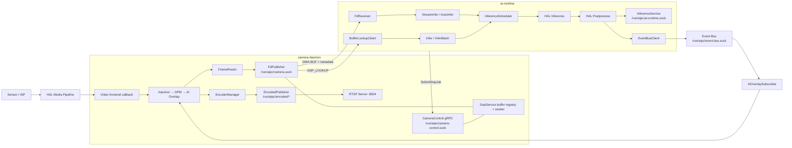
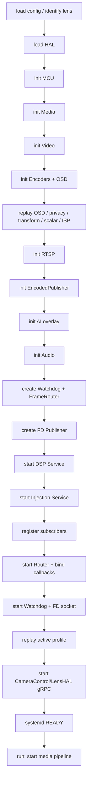
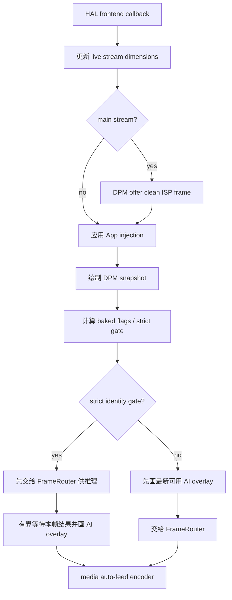
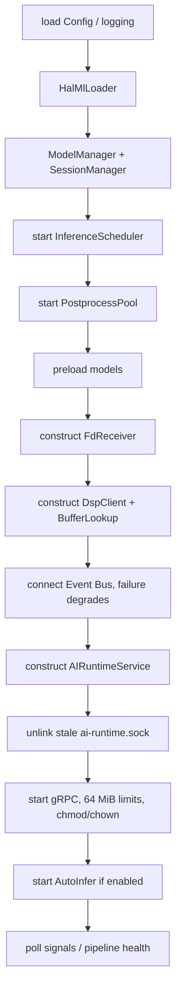
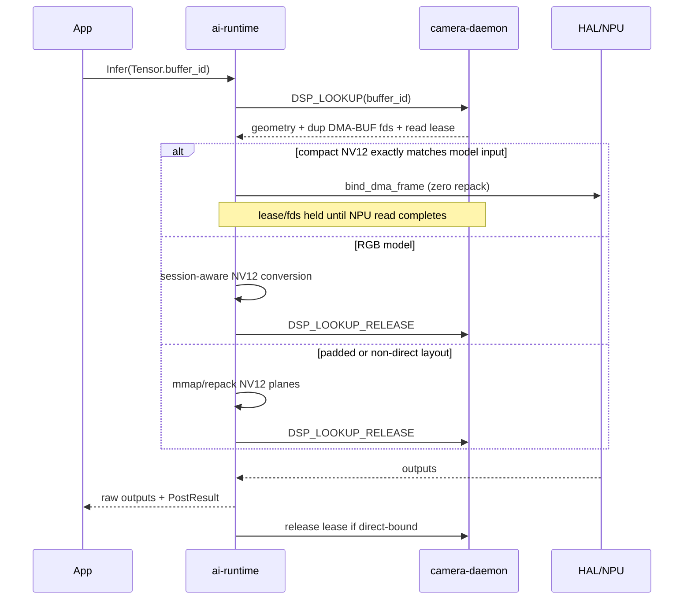
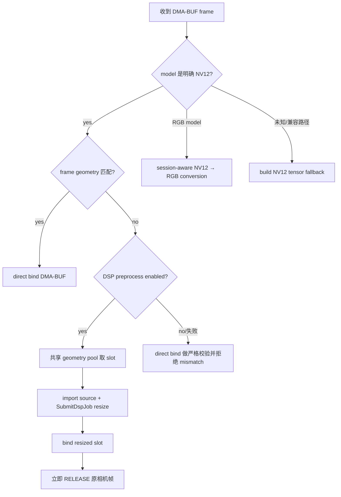
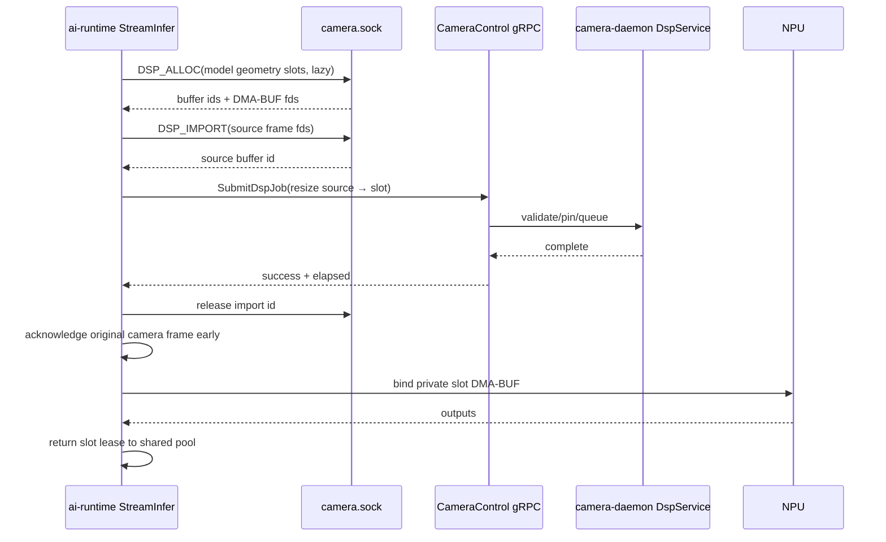
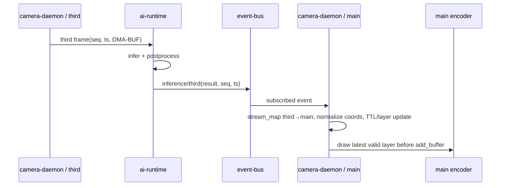

# camera-daemon 与 ai-runtime 代码解读

> 适用代码基线：`5dd77500c25e`（2026-09-21）  
> 文档核对日期：2026-09-23  
> 阅读对象：需要维护相机链路、接入模型、排查实时推理/叠加问题的研发人员

## 1. 文档目标与结论先行

这两个进程共同完成“采集画面 → 分发 DMA-BUF → NPU 推理 → 发布结构化结果 → 叠加后编码输出”的闭环，但职责边界很清楚：

- `camera-daemon` 是媒体资源和硬件控制的所有者。它加载 HAL，创建或借用媒体管线、分发原始帧、编码、提供 RTSP/编码码流、控制镜头与 ISP，并拥有平台 DSP 缓冲区注册表。
- `ai-runtime` 是模型和推理生命周期的所有者。它注册模型、调度 NPU、执行后处理、提供单次/批量/流式推理，并把结果发布到 Event Bus。
- 两者的大流量数据面不走 gRPC：原始帧通过 `/run/aipc/camera.sock` 上的 Unix Socket 与 `SCM_RIGHTS` 传递 DMA-BUF fd；gRPC 主要承担控制、任务提交和结构化结果。
- Event Bus 构成结果回路：`ai-runtime` 发布 `inference/<stream>`，`camera-daemon` 订阅并在编码前把框、关键点、模糊等绘制到目标流。
- 正确性核心不是“调用哪个 API”，而是缓冲区所有权：每个路由订阅者、FD 客户端、DSP 任务和异步推理都必须成对释放自己的引用或 lease。
- 系统明确采用“有界队列、保新丢旧、超时后异步自清理”的实时策略。过载时优先保证画面新鲜度和媒体线程不阻塞，而不是保证每一帧都推理或送达。

本文以当前源码为准。仓库已有的 [CAMERA_DAEMON_DESIGN.md](./CAMERA_DAEMON_DESIGN.md) 和 [ai-runtime.md](./ai-runtime.md) 可作为历史设计背景，但其中部分模块、默认值和流程已经落后于实现。

## 2. 一张图建立整体心智模型



有三条要特别区分的数据路径：

1. 原始视频流：`camera-daemon → camera.sock → ai-runtime`，传 fd，不复制整帧。
2. 控制与任务：客户端/`ai-runtime → gRPC`，例如注册模型、修改 ISP、提交 DSP resize。
3. 推理结果：`ai-runtime → Event Bus → camera-daemon`，传结构化检测结果，不回传图像。

## 3. 进程、端点和协议速查

| 端点 | 服务端 | 主要客户端 | 协议与用途 |
|---|---|---|---|
| `/run/aipc/camera.sock` | `camera-daemon::FdPublisher` | `ai-runtime`、受信 App | 自定义二进制协议 v1；帧订阅、`RELEASE`、DSP 分配/导入/查询；fd 通过 `SCM_RIGHTS` |
| `/run/aipc/camera-control.sock` | `camera-daemon::CameraControlServiceImpl` | platform API、`ai-runtime::DspClient`、SDK | gRPC；相机/编码/ISP/音频/硬件控制，DSP job plane，注帧 |
| `/run/aipc/ai-runtime.sock` | `ai-runtime::AIRuntimeServiceImpl` | App/SDK/platform API | gRPC；模型、会话、Infer、InferBatch、StreamInfer、统计、CLIP、GenAI |
| `/run/aipc/event-bus.sock` | `event-bus` | 两个服务 | gRPC；推理结果发布与叠加订阅 |
| `/run/aipc/encoded/<stream>.sock` | `camera-daemon::EncodedPublisher` | 插件/本地消费者 | 编码协议 v3；38 字节头 + Annex-B H.264/H.265 |
| `rtsp://<device>:8554/<stream>` | `camera-daemon::RtspServer` | 播放器/NVR | RTSP + RTP over TCP，支持 H.264/H.265，按配置附带音频 |

部署入口：

- [camera-daemon.service](../../systemd/camera-daemon.service)：`Type=notify`，等待真正完成媒体和 gRPC 初始化后发送 READY；声明 `Before=ai-runtime.service`。
- [ai-runtime.service](../../systemd/ai-runtime.service)：`Type=simple`，启动后自行连接相机与 Event Bus；连接失败的处理因功能而异。
- 相机配置：[camera-daemon.yaml](../../configs/platform/camera-daemon.yaml)。
- AI 配置：[ai-runtime.yaml](../../configs/ai/ai-runtime.yaml)。

注意：`camera-daemon.service` 的 `Before=ai-runtime.service` 只在两个 unit 同一事务启动时提供排序；`ai-runtime` 本身没有硬性 `Requires=camera-daemon.service`。因此代码仍必须正确处理相机尚未就绪、重启或连接断开。

## 4. 源码导航

### 4.1 camera-daemon

| 文件 | 作用 | 推荐关注符号 |
|---|---|---|
| [src/main.cpp](../../platform/camera-daemon/src/main.cpp) | 参数、手写 YAML 解析、日志、镜头识别、信号与 systemd READY | `load_config`、`apply_lens_model_identity`、`notify_systemd_ready`、`main` |
| [src/camera_daemon.cpp](../../platform/camera-daemon/src/camera_daemon.cpp) | 总编排、热路径、重配置、持久化、关停 | `init`、`run`、`handle_video_frame_for_routing`、`register_subscribers`、`shutdown` |
| [src/hal_loader.cpp](../../platform/camera-daemon/src/hal_loader.cpp) | `dlopen/dlsym` HAL ops 表，能力探测 | `HalLoader::load` |
| [src/video_source.cpp](../../platform/camera-daemon/src/video_source.cpp) | 视频上下文和回调；支持自建与 FROM_MEDIA 借用上下文 | `VideoSource` |
| [src/frame_router.cpp](../../platform/camera-daemon/src/frame_router.cpp) | 异步多订阅者分发、引用计数、超时强制回收 | `on_frame_arrived`、`release`、`force_reclaim` |
| [src/fd_publisher.cpp](../../platform/camera-daemon/src/fd_publisher.cpp) | UDS 接入、DMA-BUF fd 发送、lease、DSP buffer plane | `on_frame`、`client_recv_loop`、`disconnect_client` |
| [include/fd_protocol.h](../../platform/camera-daemon/include/fd_protocol.h) | `camera.sock` 的线协议定义 | `FdPubMsgType`、`FdPubFrameMsg` |
| [src/encoder_manager.cpp](../../platform/camera-daemon/src/encoder_manager.cpp) | HAL codec 包装、自动/手动喂帧、码流回调 | `EncoderManager` |
| [src/encoded_publisher.cpp](../../platform/camera-daemon/src/encoded_publisher.cpp) | 编码包异步广播、丢包后等 IDR 恢复 | `on_packet`、`broadcast` |
| [src/rtsp_server.cpp](../../platform/camera-daemon/src/rtsp_server.cpp) | RTSP 会话、RTP packetization、参数集与 RTCP | `RtspServer` |
| [src/ai_overlay_subscriber.cpp](../../platform/camera-daemon/src/ai_overlay_subscriber.cpp) | Event Bus 结果分层、绑定、TTL、strict gate、绘制 | `AiOverlaySubscriber` |
| [src/dpm_worker.cpp](../../platform/camera-daemon/src/dpm_worker.cpp) | 动态隐私遮挡推理与 mask 快照 | `DpmWorker::offer_frame`、`worker_loop` |
| [src/dsp_service.cpp](../../platform/camera-daemon/src/dsp_service.cpp) | DSP 缓冲区注册表、配额、双优先级队列、同步/异步任务 | `DspService` |
| [src/injection_service.cpp](../../platform/camera-daemon/src/injection_service.cpp) | App 注帧会话、权限、浅队列、buffer pin | `push_frame`、`take_frame` |
| [src/camera_control_service.cpp](../../platform/camera-daemon/src/camera_control_service.cpp) | gRPC 到 daemon 内部方法的边界适配与校验 | `CameraControlServiceImpl` |
| [src/autofocus_controller.cpp](../../platform/camera-daemon/src/autofocus_controller.cpp) | AF 状态机与 ISP 统计驱动 | `AutofocusController` |
| [src/lens_hal_service.cpp](../../platform/camera-daemon/src/lens_hal_service.cpp) | 镜头桥接与 LensHAL gRPC | `CreateLensHalService` |
| [src/illumination_controller.cpp](../../platform/camera-daemon/src/illumination_controller.cpp) | IR 灯随模式/变焦控制 | `IlluminationController` |
| [src/daynight_policy.cpp](../../platform/camera-daemon/src/daynight_policy.cpp) | 光敏阈值、稳定样本、最小驻留时间 | `DayNightPolicy` |
| [src/audio_service.cpp](../../platform/camera-daemon/src/audio_service.cpp) | 音频采集/播放与编码输出 | `AudioService` |

### 4.2 ai-runtime

| 文件 | 作用 | 推荐关注符号 |
|---|---|---|
| [src/main.cpp](../../platform/ai-runtime/src/main.cpp) | 组件装配、gRPC、信号、严格关停顺序 | `main`、`shutdown_runtime` |
| [src/config.cpp](../../platform/ai-runtime/src/config.cpp) | YAML 读取与默认值 | `load_config` |
| [src/hal_ml_loader.cpp](../../platform/ai-runtime/src/hal_ml_loader.cpp) | 加载 inference/post/draw/CLIP/GenAI ops，做 ABI 尾成员保护 | `HalMlLoader::load` |
| [src/model_manager.cpp](../../platform/ai-runtime/src/model_manager.cpp) | 模型注册、共享 session、owner/refcount、后处理 session | `register_model`、`acquire_model_snapshot`、`init_post_process` |
| [src/model_variant_validation.cpp](../../platform/ai-runtime/src/model_variant_validation.cpp) | model type/variant 闭集校验 | `validate_model_variant` |
| [src/session_manager.cpp](../../platform/ai-runtime/src/session_manager.cpp) | 会话限制、FPS/QPS 与统计 | `create_session`、`check_fps_limit` |
| [src/inference_scheduler.cpp](../../platform/ai-runtime/src/inference_scheduler.cpp) | 有界队列、WDRR、公平异步执行 | `submit`、`worker_loop`、`drain_async` |
| [include/async_submission_gate.h](../../platform/ai-runtime/include/async_submission_gate.h) | 处理 HAL callback 早于 `run_async()` 返回的竞态 | `AsyncSubmissionGate` |
| [src/postprocess_pool.cpp](../../platform/ai-runtime/src/postprocess_pool.cpp) | 有界 CPU 后处理线程池 | `PostprocessPool` |
| [src/grpc_service.cpp](../../platform/ai-runtime/src/grpc_service.cpp) | 全部 RPC，实现最主要的输入/输出与生命周期逻辑 | `Infer`、`InferBatch`、`StreamInfer` |
| [src/fd_receiver.cpp](../../platform/ai-runtime/src/fd_receiver.cpp) | 每物理流一条连接，多订阅者 multicast，聚合 RELEASE | `subscribe`、`recv_loop`、`unsubscribe_until` |
| [src/stream_infer_utils.cpp](../../platform/ai-runtime/src/stream_infer_utils.cpp) | DMA 绑定、帧率 gate、流式 admission 辅助 | `bind_stream_nv12_input`、`FrameRateGate` |
| [src/dsp_client.cpp](../../platform/ai-runtime/src/dsp_client.cpp) | DSP buffer plane + gRPC job plane，预处理 slot pool | `DspClient`、`StreamPreprocessPool` |
| [src/buffer_lookup.cpp](../../platform/ai-runtime/src/buffer_lookup.cpp) | 用 `buffer_id` 向相机注册表取 DMA-BUF read lease | `BufferLookupClient` |
| [src/auto_infer.cpp](../../platform/ai-runtime/src/auto_infer.cpp) | 无外部 RPC 的常驻自动推理管线 | `AutoInfer::pipeline_loop` |
| [src/event_bus_client.cpp](../../platform/ai-runtime/src/event_bus_client.cpp) | 发布结构化推理事件 | `EventBusClient` |
| [proto/inference.proto](../../platform/ai-runtime/proto/inference.proto) | AI 对外 API 与结果类型 | `InferenceService`、`Tensor`、`PostResult` |

## 5. camera-daemon 详解

### 5.1 构建形态与 HAL 边界

[CMakeLists.txt](../../platform/camera-daemon/CMakeLists.txt) 使用 C++17，主要依赖 `dl`、`pthread`、`rt`、gRPC/Protobuf，并把 HAL common 与 AF core 的一部分源码直接编入进程。可选项包括：

- `CAMERA_DAEMON_BUILD_TESTS`：构建 native 单测。
- `ENABLE_ASAN` / `ENABLE_TSAN`：内存或并发诊断。
- `HAS_GRPC`：由 gRPC/Protobuf 探测结果定义；没有时叠加订阅和控制服务相关代码会裁剪。

HAL 采用 ops table ABI。`HalLoader` 从配置中的共享库取得 video、codec、media、ISP、OSD、DSP、draw、audio、LED、MCU 等能力。上层代码通常先检查 `has_xxx()`，因此可选硬件能力缺失时应降级，而核心 media/video/codec 初始化失败会中止启动。

默认部署把 video、codec、overlay 等都指向同一个 `/data/aipc/lib/hal/libaipc_hal.so`；镜头电机使用独立 bridge 库。

### 5.2 配置解析的真实行为

`camera-daemon` 没有使用完整 YAML 库，[main.cpp](../../platform/camera-daemon/src/main.cpp) 中的 `load_config()` 是按行、section 和缩进状态解析。维护时必须记住：

- 只支持代码显式识别的 key；“合法 YAML”不等于“一定会被读取”。
- 内联注释先被剥离，字符串列表和映射多用扁平逗号语法，例如 `stream_map: "third:main,sub:main"`。
- `encoders` 是流配置的单一事实来源，解析结束后派生 `streams`。
- `lens.fg2009` 使用额外 subsection 状态；配置文件已特别提醒 `position_persistence` 必须写在 `fg2009:` 之前。
- 配置文件缺失时不会立刻失败，而是使用代码默认值；媒体 profile 或 HAL 真正初始化失败时才终止。

当前产品关键默认/配置值：

| 项目 | 当前值 |
|---|---|
| 原始帧 UDS | `/run/aipc/camera.sock` |
| FD 客户端数 / 每客户端未归还帧 | 16 / 3 |
| FD lease | 200 ms |
| watchdog 扫描 / 告警 / 回收 | 100 / 3000 / 5000 ms |
| RTSP | 开启，8554 |
| 编码发布目录 | `/run/aipc/encoded` |
| main | H.264, 1920×1080@30, 4 Mbps, GOP 30 |
| sub | H.264, 1280×720@30, 2 Mbps, GOP 60 |
| third | H.264, 640×384@15, 512 Kbps, GOP 30 |
| AI overlay 映射 | `third → main`，`sub → main` |
| App 注帧 | 默认关闭，队列默认 3 |

systemd 额外设置 `MEDIALIB_DEWARP_DSP_OPTIMIZATION=0`。这是为规避已确认的 medialib DSP dewarp 长稳死锁/内核冻结，不应把它与业务层的 dewarp 开关混为一谈。

### 5.3 启动顺序

`CameraDaemon::init()` 的顺序经过资源依赖设计，不宜随意调整：



几个看似反直觉但重要的点：

- gRPC 最晚启动，避免外部 RPC 与半初始化的媒体对象竞态。
- profile replay 放在 RTSP、编码/FD publisher 就绪之后，因为 profile 切换会拆建管线和消费者。
- 在 FROM_MEDIA 模式，所有视频流必须先 `subscribe_stream`，然后调用 `media_ops->start()`；后者可能长期阻塞，帧从 GStreamer callback 到达。
- systemd READY 发生在 `init()` 完成之后，但在 `run()` 真正调用 media `start()` 之前。其语义是“控制面和媒体对象已建立”，不是“已经收到第一帧”。
- SIGTERM 在初始化期间通过 `stop_requested_` 锁存；`run()` 先置 `running_`，再检查锁存，关闭了 init/run 交界的信号竞态。

### 5.4 FROM_MEDIA 与 standalone 两种模式

主产品走 FROM_MEDIA：

- `init_media()` 让 HAL media 从产品 profile 建立统一管线。
- daemon 从 media 取得 video/codec context 列表，这些 context 是“借用”的，销毁权仍归 media。
- 媒体节点名与外部 `main/sub/third` 通过 `video_name_map_`、`encoder_name_map_` 对齐。
- 编码器通常由 media frontend 自动喂帧，`FrameRouter` 不再注册 encoder subscriber。

standalone 是兼容/测试路径：

- daemon 自己初始化 video 与 codec context。
- `FrameRouter` 为每个有编码器的流注册 encoder subscriber，收到帧后主动 `encode_frame()`。
- `run()` 分别启动 video streams 和 encoders。

两种模式共享相同的前端 bake 函数、FD 发布、编码包发布与控制面，但“谁调用 codec add_buffer”不同。判断某个绘制动作是否进入编码流时，必须同时验证这两种模式。

### 5.5 一帧在 camera-daemon 内部如何流动

入口是 `CameraDaemon::handle_video_frame_for_routing()`：



具体顺序及原因：

1. 缓存当前流宽高，供注帧 RPC 做几何预检。
2. 只对 `main` 把未修改的 ISP 帧交给 DPM worker。`offer_frame()` 内部会把需要的数据搬到自己的 DSP ping-pong buffer，避免隐私遮挡结果反过来影响下一轮人物检测。
3. 取出当前流“最新且已到 PTS”的注入帧，执行全帧替换或局部 NV12/ARGB 叠加。
4. 读取 DPM 的不可变 snapshot：main 可直接用同尺寸 mask，sub/third 按比例缩放 mask 或 mosaic cell。
5. 应用 AI overlay。普通 preview 模式使用最新有效结果；strict 模式只在 identity mapping（如 `third→third`）且 auto-feed 时生效，先把本帧送去推理，再有界等待同 sequence 结果。
6. 把 `OVERLAY_BAKED` / `DPM_BAKED` 写入帧元数据。这些位表达“该流处于 bake 集合”，不是“本帧一定画出了非空框”。
7. 进入 `FrameRouter`；auto-feed 模式下 frontend bridge 随后把同一 buffer 送编码器，manual 模式则由 router 的 encoder subscriber 喂帧。

当前配置把 `sub`、`third` 的推理结果都画到 `main`，因此建议让 AI 订阅 sub/third，而显示/录像使用 main。不要假设所有从 `camera.sock` 取得的帧都干净；是否已 bake 应看 stream mapping 和 flags。

### 5.6 FrameRouter：引用计数是第一条生命线

`FrameRouter` 不复制像素，只浅拷贝 `HalFrameBuffer` 元数据。其生命周期模型如下：

1. HAL callback 调用 `on_frame_arrived(stream, frame)`。
2. 在订阅表锁内复制当前 active callback 列表。
3. 若没有订阅者，立即归还 HAL frame。
4. 创建 `ManagedFrame`，`ref_count = active subscriber 数`，写入全局 `frame_id`，加入 `outstanding_` 并交给 watchdog。
5. 放入容量为 8 的 dispatch queue；队列满时丢最旧项并一次性退休它的所有尚未分发引用。
6. dispatch thread 依注册顺序调用每个 subscriber。
7. 每个 subscriber 必须恰好调用一次 `frame_router_->release(mf)`；最后一个引用触发底层 `VideoSource::release_frame()`。

watchdog 与正常 release 可能并发，因此 `ManagedFrame::reclaimed` 使用 CAS 保证 HAL buffer 只归还一次。强制回收后 `ManagedFrame` 对象仍留在 `outstanding_`，直到逻辑引用全部归还，避免 FD publisher 仍持有 raw pointer 时 UAF。

值得注意的源码注释偏差：当前 [frame_router.h](../../platform/camera-daemon/include/frame_router.h) 对 `on_frame_arrived()` 的注释写着“立即释放 HAL frame”，但实现并非如此；实现以订阅者引用归零或 watchdog 回收为准。维护时以 `.cpp` 的所有权逻辑为准。

### 5.7 FdPublisher 与 camera.sock 协议

协议定义在 [fd_protocol.h](../../platform/camera-daemon/include/fd_protocol.h)，版本号为 1。普通帧流程：

```text
client  -> SUBSCRIBE(version, stream_name)
server  -> OK / ERROR
server  -> FRAME(metadata) + SCM_RIGHTS[dma_fds...]
client  -> RELEASE(frame_id)
client  -> UNSUBSCRIBE（可选；断线也会清理）
```

`FdPubFrameMsg` 在 64 位构建上保持 80 字节。字段包含 frame id、单调时钟 timestamp、HAL sequence、宽高/格式/planes/stride/size、fd 数和 bake flags。

重要实现约束：

- 每个订阅连接有独立发送配额，默认最多 3 帧未归还、最老 lease 200 ms。
- 达到配额或 lease 违规时拒绝继续借新帧，保护媒体 buffer pool；不会阻塞媒体线程等待客户端。
- 发送前必须先 `FrameRouter::retain()` 并登记 outstanding，然后才 `sendmsg()`。否则客户端可能极快返回 `RELEASE`，形成“释放先于登记”的竞态。
- socket 是 `SOCK_STREAM`。带 `SCM_RIGHTS` 的消息头必须用 `recvmsg()` 读取，因为控制消息附着在第一个数据字节；先用普通 `recv()` 会把 fd 永久丢掉。
- `sendmsg()` 返回部分写时 fd 可能已经跨进程，协议流也已失步，必须硬断开，不能从剩余偏移重试。
- `EAGAIN` 表示本次没有任何字节/fd 入队，可安全丢这一帧。
- 客户端断开时统一释放 outstanding frames、DSP buffers、lookup leases，并通知 InjectionService 关闭属于该 fd 的会话。
- 接受连接时读取 `SO_PEERCRED`，再解析 `/proc/<pid>/cmdline` 作为注帧权限身份锚点。

### 5.8 编码、EncodedPublisher 与 RTSP

`EncoderManager` 统一包装自建 codec context 和 FROM_MEDIA 借用 context。编码回调把媒体内部名称映射回 `main/sub/third`，再交给 `EncodedPublisher`。

EncodedPublisher 的设计目标是“编码回调永不被慢客户端拖住”：

- 编码回调复制 packet 到容量 120 的队列，packet sequence 在入队时分配。
- 队列溢出会留下可观测的 sequence gap。
- dispatch thread 先通知本地 listener，再向每流 UDS 客户端非阻塞发送。
- 某客户端丢失一个参考帧后进入 `needs_keyframe`，跳过后续 P 帧，直到 IDR 恢复；同时以每流最多 1 次/秒请求 encoder 强制 IDR。
- v3 header 固定 38 字节：`total_size, codec, flags, pts, width, height, dts, packet_seq`，其后是 Annex-B 数据。
- v2 的 30 字节 header 与 v3 不兼容，daemon 和旧 SDK 客户端不能混部。

RTSP server 作为 EncodedPublisher 的本地 listener，不再从 codec callback 走另一套数据路径。它负责：

- H.264 SPS/PPS 和 H.265 VPS/SPS/PPS 提取。
- RTSP 会话与 RTP/TCP interleaved packetization。
- PLAY 时请求关键帧，约每 5 秒发送 RTCP Sender Report。
- 音频开启时增加音频 track；当前产品配置为 48 kHz、单声道 PCM。

### 5.9 AI overlay：结果为什么会画到另一条流

`AiOverlaySubscriber` 订阅 Event Bus 的推理主题。核心概念不是单一“最新结果”，而是按 source/session 分层后的结果集合：

- `stream_map` 的方向是 `inference_stream → display_stream`。
- 当前 `third:main,sub:main` 表示 AI 在低分辨率流上运行，结果坐标映射后画到 main。
- 平台产生的结果（`ai-runtime` / `auto-infer`）需要显式 binding 或 legacy auto-bind；App 自己发布的 annotate 事件总是可被接纳。
- session/end 事件用于清除该 SDK 会话留下的 sidecar/layer，避免客户端断开后旧框长期残留。
- 有效期优先级是：事件自带 TTL → display stream override → global TTL → 两个 frame period → 500 ms fallback。
- polygon、检测框、landmark 和 face blur 都在同一 bake frontier 绘制。
- frame-bound 结果使用 `HalFrameBuffer::sequence`，不能换成 `FrameRouter` 的 per-stream 计数。前者是 media context 跨流共享的权威 sequence；混用会在多流环境把结果误判为迟到。

strict frame lock 的边界：

- 只对 identity mapping 生效，因为跨流 `third→main` 的结果 sequence 并不是 main 本帧的 sequence。
- 只对 auto-feed 生效；manual feed 无法保证“router 已分发但 encoder 尚未消费”的顺序。
- 等待上限若未显式配置，则按两个 frame period 推导并限制在 1–500 ms；超时后退化为 preview，不能无限阻塞媒体线程。

### 5.10 DPM：与 AI overlay 不同的隐私闭环

DPM（Dynamic Privacy Mask）是 daemon 内部独立推理 worker，并非 Event Bus overlay 的一种配置：

- 只接收 main 的干净帧。
- 用专有 DSP context 把输入 resize 到模型几何，采用有限 ping-pong buffer；已有待处理帧时直接丢新输入。
- 人体 segmentation 与 detection bbox 会 OR 到一个 main 尺寸 byte mask。
- worker 发布不可变 snapshot；媒体热路径只做 snapshot copy 与绘制，不等待 NPU。
- main 直接绘制，其他流缩放 mask/cells；因此 DPM 是全流保护。
- render mode 可为纯色 overlay、mosaic 或 blur，且拥有独立颜色/样式。
- 静态 privacy mask 仍由 media/blender 维护，二者状态与样式互不覆盖，可以叠加。

最关键的不变量是：DPM 的推理输入在 injection、DPM bake、AI overlay 之前捕获，避免被遮挡或被 App 替换后的内容进入隐私检测反馈环。

### 5.11 DSP Service：一个服务，两条传输平面

DSP 设计把 fd 传输和 job 控制拆开：

- buffer plane：`camera.sock`，执行 `DSP_ALLOC`、`DSP_IMPORT`、`DSP_BUF_RELEASE`、`DSP_LOOKUP`、`DSP_LOOKUP_RELEASE`。
- job plane：CameraControl gRPC 的 `SubmitDspJob`、`SubmitDspJobAsync`、`WaitDspJob`。

支持的 op：resize、crop-and-resize、multi-crop-and-resize、format convert、blend。buffer id 是 daemon 进程内单调递增且不复用的句柄，不是 fd。

生命周期：

- registry entry 归属于创建它的 UDS connection。
- 任务入队时对 src/dst 取得 `BufferPin`；owner 主动释放或断线只会先把 id 从 registry 摘掉，物理 buffer 等最后一个 pin 归还。
- `DSP_LOOKUP` 给另一个连接创建独立 read lease，同时返回 dup fd；关 fd 不等于释放 lease，仍必须发 `DSP_LOOKUP_RELEASE`。
- 默认同几何 buffer 在最后 pin 释放后保留 3 秒，缓存上限 192 MiB，避免 vendor pool 频繁拆建造成约 43 ms 尾延迟。
- 保留期内旧客户端若违规继续写自己保留的 fd，可能污染下一任使用者；协议要求 release 后不得再访问。

调度与保护：

- NORMAL 与 BACKGROUND 各有 HAL context，但 vendor `PriorityQueueSingleton` 仍使进程内 DSP 串行；双 lane 改善优先级，不提供并行加速。
- 单 worker 总是先取 NORMAL，再取 BACKGROUND。
- 每 owner 和全局都有 jobs/s、MPix/s token bucket。
- 有单任务像素、batch、buffer/import/lookup/async job/waiter 数量上限。
- caller timeout 后 vendor op 不能被取消，只能丢弃迟到结果并记录。

服务层错误码：`0` 成功，`-1` 参数，`-2` buffer 不存在/不属于调用者，`-3` 配额，`-4` 超时，`-5` 不可用，`-6` 内存，`-7` 资源上限。

### 5.12 App frame injection

注帧默认关闭。打开后，App 不能直接把裸 fd 写入 gRPC，而是：

1. 在 `camera.sock` 分配或导入 buffer，取得 `buffer_id`。
2. 用 `PushFrame`/`PushFrameStream` 提交 id、几何、模式、目标 stream 和 PTS。
3. daemon pin 住 buffer，放入默认容量 3 的队列。
4. 媒体热路径以 newest-due-wins 选帧并合成。
5. bake 完成后 `note_bake_done()` 结束 write lease；响应中的 `in_flight_buffer_ids` 告诉 SDK 哪些 slot 尚不能重写。

支持：

- `REPLACE`：NV12 全帧替换，必须与目标编码尺寸相同。
- `OVERLAY`：NV12 不透明区域贴入，或 ARGB32 做 CPU alpha blend。
- `pts_ns=0` 立即可用；否则使用与相机帧相同的 `CLOCK_MONOTONIC`。
- 单一 active session，owner 由 buffer 的 UDS client fd 锚定；不同 owner 会得到 busy。
- allow-list 非空时，按 `SO_PEERCRED` 推导的进程身份检查。
- owner 断线、EOS 或 StopInjection 会 flush 队列并释放 pins。

它位于 DPM clean capture 之后、DPM/AI draw 之前，所以隐私遮挡总能覆盖注入内容；同时 DPM 模型不会被 App 内容欺骗。

### 5.13 镜头、自动对焦和日夜模式

启动前镜头型号识别顺序是：自适应硬件 probe → factory EEPROM `HWREV` → `af0832` fallback。probe 与 EEPROM 冲突时，probe 胜出并告警。

LensHAL 与 CameraControl 注册在同一个 `/run/aipc/camera-control.sock` gRPC server 上，而不是独立 lens socket。LensHAL 包括原始 zoom/focus/iris 控制和 AF0832/产品级辅助动作。

AF 大致流程：

- `AutofocusController` 从 ISP 读取统计，驱动 lens controller，内部处理 startup、one-shot、zoom-follow 状态。
- AF0832 和 FG2009 使用不同几何/启动策略；FG2009 会套用专门 overrides 和 focus curve。
- 镜头最后稳定位置写入 `/data/aipc/etc/lens_position.json`，开机可恢复，再做一次 autofocus refine。
- IR illumination 可按 zoom ratio 跟随；FG2009 没有同样的 AF zoom-follow job，因此通过 lens motion observer 驱动。
- `DayNightPolicy` 使用 light sensor 的进入/退出阈值、连续稳定样本和 `min_hold_s` 抑制抖动。

### 5.14 CameraControl API 分组

[camera.proto](../../platform/camera-daemon/proto/camera.proto) 的 RPC 很多，按职责可分为：

| 分组 | 代表 RPC |
|---|---|
| AF/镜头 | `StartOneShotAutofocus`、`StartZoomFollow`、`GetAutofocusStatus` |
| ISP/图像变换 | `UpdateISPSettings`、`GetISPConfig`、`SetTransformConfig` |
| 编码/RTSP/OSD | `UpdateEncoderConfig`、`SetRtspEnabled`、`UpdateOsdConfig` |
| profile/管线/流 | `SwitchProfile`、`ReconfigurePipeline`、`AddStream`、`RemoveStream` |
| 红外与硬件 | `SetIrCut`、`SetLedDuty`、`SetImagingMode`、`GetDeviceHardwareStatus` |
| MCU/环境/IO | `McuRawRequest`、风扇/加热/雷达、报警/Wiegand、RS485 |
| 音频 | capture/playback 列表、启动、停止、PCM client stream |
| 隐私与配置 | `Get/SetPrivacyMaskConfig`、allow-list `Get/SetConfigField` |
| DSP/图片 | `SubmitDspJob[/Async]`、`WaitDspJob`、`EncodeImage` |
| 注帧 | `PushFrame`、`PushFrameStream`、`GetInjectionStatus`、`StopInjection` |

gRPC handler 不应该直接拥有媒体资源。它负责 proto 校验、错误转换和调用 `CameraDaemon` 方法；资源锁与重配置顺序仍由 daemon 内部管理。

### 5.15 持久化与运行时重配置

运行时设置不都回写 YAML。daemon 以 `/data/aipc/etc/*.json` 维护若干镜像：

| 文件 | 内容 |
|---|---|
| `osd_config.json` | OSD |
| `privacy_mask.json` | 静态 privacy mask 与 DPM 设置 |
| `transform_config.json` | rotation/flip/dewarp/grayscale/DIS/EIS，并带 lens identity |
| `media_config_fields.json` | allow-list scalar media 字段 |
| `isp_config.json` | 用户意图的完整 ISP snapshot |
| `profile_config.json` | active profile |
| `lens_position.json` | 最后稳定的 zoom/focus |
| `daynight_thresholds.json` | 用户调整后的 day/night 阈值 |

这些 mirror 在启动时按依赖阶段 replay。很多操作是 best-effort：单个持久化文件损坏或 HAL apply 失败会告警并保留可运行的默认管线，而不会把整个相机服务拉死。

重配置通常涉及 `pipeline_reconfig_mu_`、`op_mu_`、`transform_mu_` 等多层锁。代码刻意在可能阻塞的 HAL reinit 前释放数据面锁，再按固定顺序重启消费者，避免 callback 与控制线程 AB-BA。修改这部分时应把“锁持有范围”和“消费者停启顺序”作为同一项审查。

### 5.16 camera-daemon 关停顺序

`CameraDaemon::~CameraDaemon()` 调用 `shutdown()`。顺序是：

1. 停 light monitor，防止 teardown 中触发 day/night profile 切换。
2. 停 gRPC，阻止新控制请求。
3. 停 watchdog。
4. 停 AI overlay、audio、DPM worker。
5. 停 EncodedPublisher、RTSP。
6. 销毁 encoders。
7. 停 FdPublisher，迫使客户端 outstanding frame 和 DSP ownership 清理。
8. 停 InjectionService，再停 DspService。
9. 停 FrameRouter 并排空 pending frame。
10. 停 media pipeline 或 standalone video。
11. deinit video、deinit media。
12. unload HAL。

先停消费者、后毁 media buffer pool 是硬约束。反过来会让 resize pool 等待未归还 buffer，超时后在强制清理中崩溃。

## 6. ai-runtime 详解

### 6.1 组件装配与启动

[main.cpp](../../platform/ai-runtime/src/main.cpp) 的启动顺序：



gRPC UDS 权限设为 `0660`，group id 固定为 1001。日志配置写 `/var/log/aipc/...` 时，部署环境会映射到 `/data/logs/...` 或 `/opt/aipc/logs/...`，并由 HAL logging 做 10 MiB × 5 轮转。

### 6.2 配置与当前默认

`Config` 在 [config.h](../../platform/ai-runtime/include/config.h) 定义。当前产品配置重点：

| 项目 | 当前值 |
|---|---|
| gRPC | `/run/aipc/ai-runtime.sock` |
| HAL | `/data/aipc/lib/hal/libaipc_hal.so` |
| scheduler workers / queue / timeout | 4 / 64 / 5000 ms（workers 为代码默认） |
| global QPS | 100 |
| default session QPS / priority | 30 / 5 |
| postprocess workers / queue | 2 / 32（代码默认） |
| StreamInfer active RPC | 全局 16，每 peer 16 |
| 每物理流 subscriber | 4 |
| in-flight work | 全局 12，每 RPC 3 |
| stream DSP preprocess | 默认关闭 |
| preprocess pool | 每几何 4 slots，最多 4 geometries，job 100 ms |
| Event Bus publish | 开启，topic prefix `inference/` |
| AutoInfer | 默认关闭 |

YAML 中仍有 performance、monitoring 等字段，但并非每个字段都进入当前 `Config` 或业务逻辑。判断配置是否有效应从 `Config` 和 `load_config()` 双向核对，不能只看 YAML 注释。

### 6.3 HAL ML 动态能力

`HalMlLoader` 加载核心 `HAL_INFERENCE_OPS`，并按库暴露情况加载 postprocess、draw、CLIP text encoder、GenAI 等 ops。

实现对 ops table 的 `struct_size` 做 ABI guard：访问后加的尾部函数前先确认表大小足够，避免用旧 HAL 时把不存在的成员当函数指针调用。无 optional ops 时对应 RPC/后处理能力应失败或降级，不能假设 monolithic HAL 永远完整。

### 6.4 ModelManager：模型不只是一个 handle

`ModelEntry` 同时维护：

- 逻辑 id、显示名、path、type、variant、transient。
- `HalInferenceSession*` 与独立 `HalPostprocessSession*`。
- HAL 返回的 `HalModelInfo`、batch size、load time。
- 当前 inference `ref_count`。
- 多 owner 集合。

注册规则：

- 同一 model id 再注册时，path/type/variant/batch 必须与现有身份一致，才只增加 co-owner；否则拒绝，防止悄悄改掉当前解码行为。
- 同一模型文件以不同 id 注册时，可共享 inference session。fresh alias 随后初始化自己的 postprocess session；底层 inference/post 指针另有引用表，防止 alias 卸载导致 double destroy/UAF。
- transient 模型如果未给 `model_type`，必须显式 `raw_output_only=true`；否则注册失败，防止“模型加载成功但永远没有结构化结果”的静默错误。
- model type 和 variant 使用闭集 schema 校验。检测 variant 若为 bare backend function，代码会补成 vendor schema 所需的完整 JSON。
- batch > 1 时，注册后检查 HAL 报告的 input byte size 是否等于 `batch × single-frame bytes`。HAL 可能接受不受 HEF 支持的 batch 参数但仍按单帧运行，因此必须在这里拒绝假 batch。

推理线程通过 `acquire_model_snapshot()` 原子增加 ref，并取得按值拷贝；结束时 `release_model()`。`ModelGuard` 处理异常/提前返回路径。模型 busy 时最后 owner 的物理卸载会失败，避免销毁仍被异步 callback 使用的 HAL session。

### 6.5 SessionManager

Session 是调度、公平性和统计的归属单位：

- id/app/stream/model 标识只允许 ASCII `[A-Za-z0-9._-]`，最多 128 字节。
- 全局最多 1024 session，每 app 最多 128。
- 内含 FPS/QPS gate、priority、inference 数与累计延迟、stream result skew。
- map 存 `shared_ptr<Session>`。销毁只从 map 移除，已经被 HAL callback 持有的对象继续活到最后一个引用释放，避免并发 unregister 的 UAF。
- 单次 `Infer` 自动建立 `implicit-<model>` session 用于统计；请求无效 model 不会先污染 session registry。
- `StreamInfer` 每个 RPC 建独立 session，退出时销毁并发布 session/end。

### 6.6 InferenceScheduler：有界、公平、能处理 callback 反转

Scheduler 的队列是“按 session 分桶、总量有界”，不是一个简单 priority queue。worker 选择使用 weighted deficit round robin：

- priority 范围 0–7，对应 weight 1–8。
- 每轮所有非空 session 增加自己的 weight。
- 选择 deficit 最大者，取一个任务后减去 active session 的总 weight。
- 高优先级得到更多份额，但低优先级仍会积累 deficit，不会永久饥饿。

执行优先走 HAL async：

- `run_async()` 允许 callback 在函数返回之前触发，这是常见而危险的 completion-before-return 竞态。
- `WorkerCallbackState` 初始有 submitter/callback 两个 owner，`AsyncSubmissionGate` 协调“提交成功/失败”和“callback 已发生”。
- async 不可用或提交失败时回退同步 `infer()`。
- `owns_outputs=true` 表示 completion callback 接管 HAL outputs 和 model ref，常用于把后处理继续转到线程池；否则 scheduler 在 callback 返回后统一清理。
- `async_in_flight_` 和 external async tracker 支持关停时有界 drain。

队列超时或 gRPC 等待超时不等于 HAL 作业被取消。真正安全的模式是：调用线程可先返回，但 completion 必须仍持有所有输入资源，并在迟到时自清理 outputs、model ref、frame delivery 和 admission permit。

### 6.7 PostprocessPool 与结构化结果

后处理把 HAL outputs 转为 [PostResult](../../platform/ai-runtime/proto/inference.proto) 中的：

- detection bbox/class/confidence/label；
- classification；
- landmark set；
- segmentation RLE mask；
- OCR line；
- embedding；
- depth map。

`PostprocessPool` 有界，提交失败时调用者通常在当前线程同步执行，保证资源最终释放而不是丢掉 cleanup。`free_post_result()` 必须在 proto copy 完成后调用；segmentation/depth 等 backend 会为结果分配内存，遗漏会形成持续大泄漏。

### 6.8 Infer：bytes 与 buffer_id 两条输入路径

`Infer` 接收 `Tensor.data` 或 `Tensor.buffer_id`。`Tensor.dma_fd` 明确拒绝，因为整数 fd 只在产生它的进程 fd table 中有意义，跨 gRPC 传数字可能绑定到完全无关的 descriptor。

bytes 路径：

1. 把 protobuf bytes 复制进独立 holder，避免 RPC 超时返回后 request 被析构。
2. 根据 wire dtype/shape 构造 `HalTensor`。
3. 提交 scheduler，completion 复制 raw outputs、执行后处理、填写耗时并清理。

buffer id 路径：



直接绑定要求模型第一个输入、NV12 格式、紧凑布局和精确几何均满足；不满足会转换或 repack。几何来自 daemon registry，不信任调用方声称的 tensor shape。

RPC 默认等 5 秒。若超时，gRPC 返回，但 completion 的 shared state 仍负责迟到清理；不能把“客户端看到 timeout”理解成模型引用或 DMA lease 已立即释放。

### 6.9 InferBatch

`InferBatch` 保持请求顺序返回。两种执行形态：

- batch=1 模型或无法组成 true batch：多个 item 按独立推理并行提交，最终聚合。
- 注册 batch=B 的模型：只接受符合 B 组大小和同模型要求的输入，把 B 个 frame 打包到一次 NPU job，再按 batch 维切分 outputs，分别后处理。

true batch 的 model ref、output buffer 和 postprocess task 都计入 external async tracker，关停时必须等它们完全结束。任一 item 的 `buffer_id` 输入沿用 Infer 的 lookup/direct-bind/repack 规则。

### 6.10 StreamInfer：实时数据面的主路径

一个 StreamInfer RPC 的生命周期：

1. 校验 stream id、fps ≤ 120、confidence、class filter 数量。
2. 获取 RPC admission permit：限制全局、peer、每流订阅者。
3. acquire model snapshot，创建 session。
4. 向 `FdReceiver` 以唯一 subscriber id 订阅 stream。
5. callback 只保留 latest frame；新帧到来时先 acknowledge 尚未消费的旧帧。
6. 主循环按 frame-driven `FrameRateGate` 决定是否提交；限速窗口内的帧立即 release，不积攒到下一个时间点。
7. 获取 per-RPC/global work permit。
8. 选择输入准备路径、提交 scheduler、等待 completion。
9. filter result、可选 Event Bus publish、写 gRPC stream。
10. RPC 结束时先关闭 callback 接纳，再以 5 秒 deadline unsubscribe。

NV12 输入路径选择：



DSP preprocess pool 按模型几何共享，而不是每 RPC 独占；只有第一次遇到 mismatch 才分配，默认每池 4 slot、最多 4 种几何。resize 完成后原始 camera frame 可提前 RELEASE，NPU 只持有 private slot lease。

结果 shaping 在 postprocess 后执行：minimum confidence、class allow-list、top-k、去 label、只发非空。`only_nonempty` 抑制的结果也不会发布到 Event Bus，确保 RPC 与 bus 看到一致语义。

性能字段：

- `repack_us`：CPU convert/repack；direct DMA 为 0。
- `dsp_us`：DSP resize。
- `queue_us`：scheduler 排队。
- `infer_us`：HAL bind/submit/completion wall time。
- `hw_infer_us`：后端可提供时的纯 NPU 时间；当前 NV12 路径常为 0。
- `post_us`：后处理。
- `write_us`：gRPC Write 成本，因本次写发生在字段确定之后，按后一条响应回报。
- `skew_us`：结果 ready 的单调时钟减 capture timestamp。

### 6.11 FdReceiver：一条物理连接，多份逻辑交付

同一 stream 的多个 StreamInfer/AutoInfer subscriber 共享一条到 camera-daemon 的物理 socket 和一个 recv thread。

收到帧后：

- fd 收进 `shared_ptr<FdGroup>`，最后一个引用析构时统一 close。
- 每个 subscriber 得到自己的 `FrameDelivery`。
- 每份 delivery 调用 `acknowledge()` 是幂等的。
- 只有全部 subscriber 都 acknowledge 后，才向 camera-daemon 发送一次物理 `RELEASE(frame_id)`。

这意味着任一慢 subscriber 都能延长该 camera frame 的 lease。上层的 latest-only 逻辑和 per-stream subscriber 上限正是为此存在。

unsubscribe 是并发难点：不能在 recv callback 所在线程 join 自己，也不能在 callback/delivery 尚未退出时销毁 state。实现用 timed mutex、drain state、deferred teardown 与 deadline-aware `unsubscribe_until()` 处理这些情况；任何新 callback 在 quiesce 后只做 acknowledge。

### 6.12 AutoInfer

AutoInfer 用配置常驻运行，不需要外部 StreamInfer 客户端。每条 pipeline 指定 model、stream、fps：

- 启动时 acquire 模型并建立独立 FdReceiver subscriber。
- camera 尚未可用时最多重试 30 次，每次约 2 秒；整个 `start()` 的启动握手上限为 10 秒，因此 pipeline 没有及时报告成功会使 runtime 启动失败。
- 使用 latest-only frame state，最大 in-flight 约 3，避免拖住相机。
- 当前 AutoInfer 与 StreamInfer 不同：它 mmap 相机 DMA-BUF，在 CPU 上进行 NV12 resize/copy 或 NV12→RGB，再把自有输入交给 scheduler；尚未复用 StreamInfer 的 direct-bind/DSP pool 主路径。
- completion 进入 PostprocessPool，发布 `inference/<stream>`，source 标记为 auto-infer。
- event id 含进程实例 token、model、stream、连接 generation、frame sequence 和 timestamp，防止重连/重启后碰撞。
- 任一已启动 pipeline 意外退出会使整个 ai-runtime 走受控失败关停，而不是留下“服务还活着但自动推理已死”的假健康状态。

### 6.13 Event Bus 结果发布

StreamInfer 和 AutoInfer 都能发布 PostResult。事件携带 stream/model、frame sequence、capture timestamp、source/session 等元数据，camera overlay 依此做映射、TTL 和 frame binding。

Event Bus 初始连接失败时 ai-runtime 继续提供 RPC 推理，只是没有自动结果发布。也就是说“StreamInfer RPC 有结果但画面无框”时，应分别检查：

1. `event_bus_auto_publish` 是否开启；
2. EventBusClient 是否连接；
3. topic prefix 是否一致；
4. camera overlay binding/stream_map 是否允许；
5. 结果是否被 `only_nonempty` 抑制或 TTL/frame binding 丢弃。

### 6.14 AI gRPC API

[inference.proto](../../platform/ai-runtime/proto/inference.proto) 定义：

| 分组 | RPC |
|---|---|
| 模型 | `RegisterModel`、`UnregisterModel`、`ListModels`、`GetModelInfo` |
| 推理 | `Infer`、`InferBatch`、server-streaming `StreamInfer` |
| 会话 | `CreateSession`、`DestroySession` |
| 监控 | `GetStats`，采样窗口限制 1–5000 ms |
| 后处理 | `UpdatePostprocessConfig` |
| CLIP | `EncodeText` |
| GenAI | create/destroy session、streaming generate、abort |

多数业务错误通过 `grpc::Status::OK + response.status.success=false` 返回；参数/admission/资源类 StreamInfer 错误则更多使用 gRPC status。客户端必须同时检查 transport status 和 payload status。

### 6.15 ai-runtime 关停

信号 handler 只置 atomic flag，不在 signal context 调用 gRPC `Shutdown()`，因为 `Wait()` 的内部锁可能导致死锁。主线程执行：

1. `server->Shutdown()`，join 独立的 `server->Wait()` thread。
2. 停 AutoInfer，停止新 frame submission。
3. 停 scheduler workers；它们排空已取队列，但 HAL async callback 仍可能在飞。
4. `scheduler.drain_async(5000)`。
5. 如果仍有 orphan，调用 `std::_Exit(EXIT_FAILURE)`，不运行 C++ destructor；这是为了避免迟到 callback 访问已析构的 raw dependency。
6. 停 PostprocessPool，确保 output/free/model release 完成。
7. `FdReceiver::stop_all()`，断 Event Bus，unlink socket。

AutoInfer 自身也有 5 秒 shutdown deadline。若 unsubscribe、pipeline thread 或 outstanding work 无法在期限内收敛，同样 `_Exit`。这是“宁可由 OS 一次性回收整个进程，也不冒 callback UAF”的明确策略。

## 7. 两个服务的关键端到端时序

### 7.1 精确匹配的 StreamInfer 零拷贝路径

```mermaid
sequenceDiagram
    participant M as Media frontend
    participant C as camera-daemon
    participant F as FdReceiver
    participant S as Scheduler
    participant N as NPU
    participant E as Event Bus

    M->>C: HalFrameBuffer(NV12 DMA-BUF)
    C->>C: injection / DPM / optional overlay
    C->>F: FRAME + SCM_RIGHTS fds
    F->>S: HalTensor bound to frame fds
    S->>N: run_async
    N-->>S: outputs callback
    S->>F: FrameDelivery.acknowledge
    F->>C: RELEASE(frame_id), only after all subscribers ack
    S->>S: postprocess + filter
    S->>E: inference/<stream>
    E-->>C: structured result
    C->>C: cache layer; draw on target display stream
```

这里“零拷贝”指 camera frame 到 NPU input 不做整帧 CPU memcpy；socket 仍传 metadata，内核仍复制 fd 引用，后处理结果仍有序列化。

### 7.2 几何不匹配的 DSP preprocess 路径



buffer plane 与 job plane 必须绑定到一致的 daemon 实例；camera-daemon 重启后旧 buffer id 全部失效，client 要重建连接与 pool。

### 7.3 结果画框闭环



跨流映射不能提供严格的“同一 frame sequence”锁定；它提供低延迟 preview 语义。若业务要求逐帧精确绑定，推理和显示必须 identity mapping，并接受等待带来的编码延迟。

## 8. 必须维护的所有权与并发不变量

| 不变量 | 破坏后的典型后果 |
|---|---|
| 每个 FrameRouter subscriber 对每帧恰好 release 一次 | 少一次耗尽 media pool；多一次 refcount 下溢/UAF |
| 每个 FdReceiver logical delivery 最终 acknowledge | camera-daemon lease 超时、拒绝新帧 |
| `SCM_RIGHTS` 消息首字节用 `recvmsg` | fd 丢失、协议无法恢复 |
| direct-bound tensor 持有 fd + registry/frame lease 到 NPU read 完成 | NPU 读取已复用 buffer，结果随机或崩溃 |
| timeout 后 completion 仍独立完成 cleanup | output/model/frame/admission 永久泄漏 |
| postprocess result copy 后调用 `free_post_result` | segmentation/depth 持续内存泄漏 |
| profile/transform reconfigure 先停消费者，再毁 media pool | resize pool teardown 超时与崩溃 |
| injection compose 后才结束 write lease | App 提前重写 slot，画面撕裂/混帧 |
| DPM 只在 bake 前捕获 clean main | 遮挡反馈导致人物逐步“消失” |
| 使用 HAL sequence 做 overlay frame binding | 多流计数域不一致，结果被误判迟到 |
| scheduler/AutoInfer destroy 前 drain async callback | callback 访问已析构 manager/service |
| model alias 的物理 session 引用计数正确 | 一方卸载造成另一方 UAF 或 double destroy |

锁方面的通用规则：

- 不在持有 registry/subscriber map 锁时调用未知外部 callback。
- 不在媒体数据面 shared mutex 的 exclusive 区间执行可能无限等待的 HAL reinit。
- 不在 recv thread callback 内同步 join 自己。
- teardown 先把“接受新工作”置 false，再等待已进入的 callback/delivery 收敛。
- shared object 的最后释放路径要能从正常完成、超时、断线、异常和 shutdown 五种入口到达。

## 9. 背压、丢帧和故障语义

系统中的丢弃点不是偶然错误，而是实时设计的一部分：

| 位置 | 上限/条件 | 策略 |
|---|---|---|
| FrameRouter dispatch | 8 | 丢最旧 queued frame |
| FdPublisher client | outstanding 3 / lease 200 ms | 拒绝给该客户端新帧；只有发送硬错误/协议失步才断开 |
| EncodedPublisher | 120 packets | 队列溢出可见 seq gap；客户端等下个 IDR |
| StreamInfer callback buffer | 1 latest | 新帧替换并 release 未消费旧帧 |
| StreamInfer admission | global/RPC caps | 立即 drop frame 或拒绝 RPC |
| FPS gate | 帧到达过早 | 立即 release，不延迟缓存 |
| DPM | 已有 pending | drop 新 offer |
| Injection | 默认 3 | drop oldest，newest-due-wins |
| Scheduler | 总队列 64 | submit 失败，调用者返回 queue full |
| PostprocessPool | 默认 32 | 当前线程同步 fallback |

排障时先判断属于哪种语义：

- “画面不断但 AI FPS 下降”通常是 admission/FPS/latest-only 正常降载。
- “相机突然不给该 AI 客户端新帧”常见于未 acknowledge 或 lease 超时。
- “编码客户端停在某一帧后恢复”可能是丢包后等待 IDR。
- “RPC timeout 但数秒后资源才下降”是迟到 completion 自清理，不一定是泄漏。
- “结果正常但画面不画框”优先检查 Event Bus 与 binding，而非 NPU。

## 10. 安全边界

- Unix sockets 依赖文件权限和 aipc group；不是网络暴露的 TLS endpoint。
- `Tensor.dma_fd` 被拒绝，避免跨进程 fd-number confused deputy。
- DSP buffer id 按 owner connection 校验，lookup 使用显式 lease 和上限。
- 注帧权限以拥有 buffer 的 UDS peer 身份为锚，不信任 gRPC 请求自报 app id。
- 注帧默认关闭；allow-list 空值是开发环境“全允许”，生产启用功能时应配置明确名单。
- media scalar config 只允许代码 allow-list 中的路径，避免与 typed RPC 形成两个 writer。
- OSD image path、坐标、尺寸等在 apply 前做 sanitize。
- gRPC message 上限 64 MiB，但大图优先使用 buffer id，不应靠放大 protobuf 传像素。

## 11. 构建、测试与调试

### 11.1 常用构建

项目顶层目标：

```bash
make camera-daemon
make ai-runtime
make build-native
```

直接 native CMake：

```bash
cmake -S platform/camera-daemon -B platform/camera-daemon/build-host-tests \
  -DCAMERA_DAEMON_BUILD_TESTS=ON
cmake --build platform/camera-daemon/build-host-tests -j

cmake -S platform/ai-runtime -B platform/ai-runtime/build-stub
cmake --build platform/ai-runtime/build-stub -j
```

交叉编译会使用 `proto_gen_arm` 中预生成代码；更新 proto 后要运行 [generate_proto_arm.sh](../../scripts/generate_proto_arm.sh)，同时保持 C++ 与 Go 生成物一致。

### 11.2 单测

当前工作树已有 build 目录时可运行：

```bash
ctest --test-dir platform/camera-daemon/build-host-tests --output-on-failure
ctest --test-dir platform/ai-runtime/build-stub --output-on-failure
```

camera tests 重点覆盖 overlay binding/strict/session/polygon/face blur、day-night、illumination、DSP lane/retention/import/async 生命周期、injection owner、FG2009 position。AI tests 覆盖 model/session/scheduler/async 生命周期、FdReceiver deadlock 与 stream helpers。

修改 buffer ownership、callback 或 teardown 时，建议额外用：

```bash
cmake -S platform/ai-runtime -B /tmp/ai-runtime-asan -DENABLE_ASAN=ON
cmake --build /tmp/ai-runtime-asan -j
ctest --test-dir /tmp/ai-runtime-asan --output-on-failure
```

TSAN 对 vendor HAL/driver 可能有噪声，但对纯 host stub 的 router/receiver/session 测试很有价值。

### 11.3 设备排障顺序

```bash
systemctl status camera-daemon ai-runtime event-bus
journalctl -u camera-daemon -b --no-pager
journalctl -u ai-runtime -b --no-pager
ss -xl | grep /run/aipc
ls -l /run/aipc/camera.sock /run/aipc/camera-control.sock \
      /run/aipc/ai-runtime.sock /run/aipc/event-bus.sock
```

建议按层定位：

1. camera-daemon 是否 READY、是否持续收到各流帧。
2. `camera.sock` 连接、subscribe 和 RELEASE 是否正常。
3. model 是否 registered，input geometry/byte size 是否匹配。
4. scheduler queue/admission 是否持续满。
5. postprocess 是否失败；注意 journal 为防洪会限频，但 response status 每帧都反映失败。
6. Event Bus publish/subscribe 与 overlay binding。
7. encoder packet sequence、客户端是否长期 `needs_keyframe`。

性能分析优先看 `StreamInferResponse.perf` 与 `skew_us`，再看系统利用率：

- `dsp_us` 高：DSP 排队、pool miss 或 resize 尺寸过大。
- `queue_us` 高：scheduler workers/模型争用。
- `infer_us` 高而 queue 低：NPU 或模型自身。
- `post_us` 高：CPU 后处理或输出过大。
- `write_us` 高：客户端读取慢；随后可能增加 retained response/frame 压力。
- skew 远大于各段之和：检查 frame timestamp 时钟域、callback 缓存、客户端 write。

## 12. 常见修改应该落在哪里

| 需求 | 首选修改点 | 同时检查 |
|---|---|---|
| 增加相机 RPC | `camera.proto` + `camera_control_service.cpp` + `CameraDaemon` 方法 | proto 生成物、权限、持久化、重配置锁 |
| 增加 AI RPC/结果字段 | `inference.proto` + `grpc_service.cpp` | Go/C++ 生成物、Event Bus 转换、旧客户端默认值 |
| 增加原始帧 metadata | `fd_protocol.h` 两端 | struct size/对齐、版本兼容、SDK parser |
| 增加 DSP op | `camera.proto`、`DspService`、gRPC mapping | 输入/输出 pin、像素计费、超时、import 写权限 |
| 新后处理类型 | HAL post ops + `ModelManager::init_post_process` | variant schema、free_post_result、proto 映射 |
| 新 stream | camera YAML/media profile | name mapping、encoder、FD subscribe、overlay map、RTSP URL |
| 改 overlay 精确性 | `AiOverlaySubscriber` + bake frontier | sequence 时钟域、strict auto-feed 限制、TTL |
| 提升 StreamInfer resize 覆盖率 | `DspClient/StreamPreprocessPool` | pool 几何上限、camera restart、source early release |
| 让 AutoInfer 真正零拷贝 | `auto_infer.cpp` | 复用 direct-bind/DSP pool，shutdown ticket 与 delivery 生命周期 |
| 改关停时限 | 两个 main/AutoInfer/FdReceiver | callback raw dependency 是否仍存活，不能只延长等待 |

## 13. 当前实现中容易误读或值得后续整理的点

1. `camera-daemon` 配置是手写行解析，不是通用 YAML；增加嵌套结构很容易“配置看似存在、实际没生效”。
2. `frame_router.h` 关于立即归还 HAL frame 的注释与当前实现不一致。
3. `register_subscribers()` 中 FD subscriber 的“clean frame”注释过于简化；实际 bake 顺序取决于 preview/strict 和 stream 是否为 overlay/DPM target，应以 flags 与 `handle_video_frame_for_routing()` 为准。
4. AutoInfer 仍是 CPU mmap/resize 路径，而 StreamInfer 已有 direct DMA 和可选 DSP preprocess；两条路径性能语义不同。
5. 配置 YAML 中有一些 performance/monitoring 字段当前未进入 `Config`，容易让运维误以为已生效。
6. CameraControl 与 LensHAL 共用同一个 gRPC socket；不要按旧文档寻找 `/run/aipc/lens-hal.sock`。
7. systemd 的 READY 在 media `start()`/首帧之前；健康检查如要求视频真正可用，应额外观察 stream status/first frame。
8. strict overlay 在跨流 mapping 下天然不能逐帧锁定；这是计数域与因果关系限制，不是简单调大 timeout 能解决。
9. DSP 双 context 只改变 vendor queue priority，不代表两个 DSP job 并行。
10. gRPC timeout、DSP caller timeout 和底层硬件取消是三件事；当前许多底层 op 不支持取消。

## 14. 推荐阅读顺序

若是第一次接手，建议按以下顺序读源码：

1. 两个 [main.cpp](../../platform/camera-daemon/src/main.cpp) / [AI main.cpp](../../platform/ai-runtime/src/main.cpp)，理解装配和关停。
2. `CameraDaemon::init/run/shutdown` 与 `handle_video_frame_for_routing`。
3. `FrameRouter`、`FdPublisher`、`fd_protocol.h`，先吃透帧所有权。
4. `FdReceiver` 与 `StreamInfer`，沿同一帧跨进程追踪。
5. `InferenceScheduler`、`ModelManager`、`SessionManager`，理解异步回调资源边界。
6. `EventBusClient` 与 `AiOverlaySubscriber`，补上结果回路。
7. 再按任务进入 DSP、DPM、Injection、AF、RTSP 或 GenAI 等专项模块。

用一次真实帧做纸面追踪最有效：写下它在每一层的 `frame_id`、HAL `sequence`、timestamp、fd owner、router ref、delivery ack、model ref、output owner 和 Event Bus event id；只要每个资源都能找到唯一、可达的释放点，绝大多数并发问题就已经被排除。

## 15. 术语表

| 术语 | 含义 |
|---|---|
| FROM_MEDIA | video/codec context 由统一 media pipeline 创建，daemon 借用 |
| DMA-BUF | Linux 跨设备/进程共享 buffer 的 fd-backed 机制 |
| SCM_RIGHTS | Unix Socket 传递 fd 的 ancillary data 机制 |
| bake | 在 encoder 消费前把注入、隐私遮挡、AI 图形写入像素 |
| DPM | Dynamic Privacy Mask，daemon 内部的动态人物隐私遮挡 |
| frame lease | 借出 frame 后到 RELEASE/acknowledge 的持有期 |
| buffer pin | DSP job/lookup/injection 对 registry buffer 的物理存活引用 |
| WDRR | Weighted Deficit Round Robin，加权且不饿死低优先级会话 |
| identity mapping | 推理流与显示流相同，如 `third→third` |
| cross-feed | 低分辨率流推理、结果画到另一流，如 `third→main` |
| preview semantics | 使用最新仍有效结果，不保证与当前画面同一 frame sequence |
| strict frame lock | 对 identity stream 有界等待本帧结果后再编码 |
| late completion | RPC/调用者已超时返回，但 HAL callback 后续才完成 |
